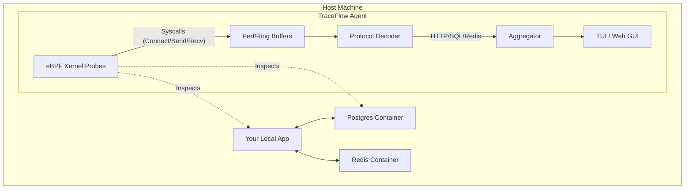
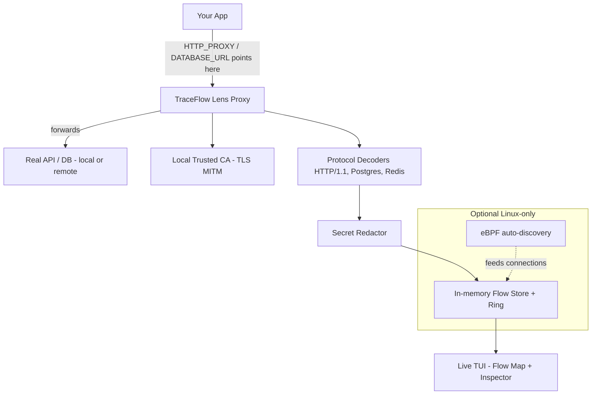
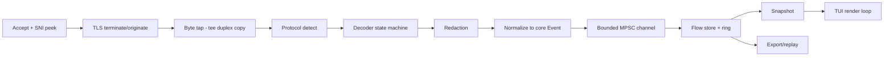

Note 
1)**TraceFlow** aka **Lens**
2)**This is a vibe coded project use with caution**

The Blueprint - **TraceFlow**


### Vision
To make the "invisible" interactions between modern software components visible to every developer, making local debugging as easy as looking at a map.

### Architecture Diagram


### Core Abstractions
- **Flow**: A sequence of related network/IPC operations between two PIDs or Containers.
- **Probe**: An eBPF program attached to kprobes/tracepoints (e.g., `tcp_sendmsg`, `sys_enter_write`).
- **Decoder**: A userspace module that parses raw bytes into protocol-specific data (e.g., "GET /users", "SELECT * FROM...").
- **Identity**: Mapping PIDs to container names, user accounts, and binary paths.

### Internal Engine
- **eBPF (CO-RE)**: For portable, high-performance kernel tracing.
- **Ring Buffers**: Efficiently passing event data from kernel to userspace.
- **Protocol State Machines**: Tracking multi-packet requests/responses (especially for database protocols).

### Security Model
- **Read-Only**: TraceFlow only observes; it never modifies execution.
- **Local-Only**: Data never leaves the machine.
- **Root-Required**: Explicitly requires `sudo` or `CAP_SYS_ADMIN` to load eBPF.

### MVP Scope (4-6 Months)
- Single-binary Rust agent.
- eBPF probes for TCP/UDP and Unix Sockets.
- Decoders for HTTP/1.1 and PostgreSQL.
- Interactive TUI showing a live "Traffic Map" between processes.
- Latency tracking (Time-to-First-Byte) for every flow.

### Risks
1. **Kernel Compatibility**: Supporting older kernels without BTF (Bpf Type Format).
2. **Overhead**: Ensuring the eBPF probes don't slow down the system significantly under high load.
3. **Complexity**: Parsing fragmented packets in userspace correctly.

Red Team — Destroying TraceFlow

I now act as the principal architect whose job is to *kill* this idea. Below is every weakness I can find, organized by category. Each is rated by severity (Critical / High / Medium).

### Hidden Engineering Problems
- **(Critical) The "local microservices" premise is shrinking.** The killer demo assumes developers run Postgres + Redis + their app as local processes/containers. In reality, most modern dev setups use *remote* managed databases (RDS, Supabase, Neon, Upstash), hosted Kafka, etc. If the DB is remote, eBPF on the laptop only sees an opaque encrypted TCP stream to a cloud IP — no SQL, no insight. The "magic service map" collapses to "app → unknown cloud endpoint."
- **(Critical) TLS everywhere blinds the decoders.** Postgres connections increasingly use TLS; Redis 6+ supports TLS; HTTP is mostly HTTPS. eBPF kprobes on `tcp_sendmsg` see *ciphertext*. To decode you must hook into userspace TLS libraries (uprobes on OpenSSL `SSL_write`/`SSL_read`, BoringSSL, Go's crypto/tls, Rust rustls, Node, JVM). Each library/version/static-link/stripped-binary is a separate, fragile uprobe target. This is the single hardest part of the entire product and it is *required* for the demo to work.
- **(High) Protocol decoding in userspace is a swamp.** HTTP/1.1 is easy; HTTP/2 is multiplexed + HPACK-compressed (stateful, needs full stream reassembly); gRPC rides on HTTP/2; Postgres wire protocol has extended-query/prepared-statement flows; Redis has RESP2/RESP3. Each decoder is a stateful parser that must handle partial reads, out-of-order ring-buffer events, and dropped events under load.
- **(High) Event loss under load is unavoidable.** Ring/perf buffers drop events when userspace can't keep up. A dropped `recv` mid-stream desyncs the protocol parser, producing garbage or silent gaps — exactly when the tool is most needed (high traffic = debugging).
- **(Medium) PID→container→service identity mapping is brittle.** Resolving PIDs to container names requires reading cgroup paths, talking to the Docker/containerd/CRI-O socket, handling PID namespaces, short-lived processes, and PID reuse. Each container runtime differs.

### Kernel Compatibility & eBPF Limitations
- **(Critical) Not cross-platform.** eBPF is Linux-only. macOS and Windows developers — a *huge* fraction of the target audience — get nothing natively. "Run it in a Linux VM/WSL2" breaks the demo because the app/DB the developer cares about runs on the host, outside the VM's kernel view. This alone caps adoption severely.
- **(High) CO-RE/BTF requirement excludes many kernels.** CO-RE needs BTF (kernel ~5.2+ with `CONFIG_DEBUG_INFO_BTF`). Older LTS distros, many cloud images, and embedded kernels lack BTF. Fallback (BCC-style runtime compilation) drags in LLVM/Clang and kernel headers — destroying the "single 30-second binary" promise.
- **(High) uprobe fragility.** uprobes on TLS libs break across versions, with static linking, stripped symbols, Go's non-standard ABI/goroutine stacks, musl vs glibc, and language runtimes (JVM JIT, Node) that don't use libssl symbols predictably.

### Security Concerns
- **(High) Requires root / CAP_BPF + CAP_SYS_ADMIN.** A `curl | sh` tool asking for root to load kernel programs and read all process memory/traffic is a giant attack surface and a hard sell in any security-conscious org.
- **(High) Plaintext capture = secret leakage.** Decoding TLS means the tool sees passwords, tokens, PII, and SQL with literal values. Storing/displaying this (even locally) is a compliance and incident risk; screenshots shared for "virality" can leak secrets.
- **(Medium) Kernel-load risk.** A bug in an eBPF program or verifier edge case can stall or panic sensitive workloads.

### Performance Bottlenecks
- **(High) Per-syscall overhead on hot paths.** Probing `tcp_sendmsg`/`recvmsg` on a busy host adds overhead to every I/O. Userspace decoding of every byte stream is CPU-heavy; under real load the agent competes with the very app being debugged.
- **(Medium) Memory growth from stream reassembly.** Holding partial HTTP/2 streams and prepared-statement maps per-connection can balloon memory on connection-heavy hosts.

### UX Risks
- **(High) "Empty map" first impression.** If TLS isn't decoded or the DB is remote, the user runs the magic command and sees blobs/encrypted lines — the opposite of the promised wow. First-run failure kills word-of-mouth.
- **(Medium) Root prompt friction.** The 30-second promise dies at `sudo` + kernel-version checks + "BTF not found, installing headers..."
- **(Medium) TUI vs Web GUI scope creep.** Building both a great TUI *and* a web UI doubles surface area for a solo MVP.

### Maintenance Burden
- **(High) Endless decoder + uprobe treadmill.** Every new TLS lib version, language runtime, protocol, kernel release, and container runtime is ongoing maintenance. This is the kind of project that rots fast without a team.

### Adoption Risks & Competitors
- **(Critical) Strong incumbents.** Pixie (open source, CNCF, eBPF, auto-instrumentation, TLS via uprobes — already does most of this), Cilium/Hubble, Coroot, Odigos, Parca, bpftrace/bcc, Wireshark, plus DataDog/New Relic. The "this doesn't exist" claim is false; Pixie is essentially the cluster version of this idea.
- **(High) Cloud vendors can copy trivially.** Cloudflare, Datadog, and the Cilium team already have the eBPF expertise; a local-dev variant is a weekend spike for them.

### Why Developers Might Not Use It
- Their stack is remote/managed → tool sees nothing useful.
- They're on macOS/Windows → tool doesn't run.
- It needs root → blocked by policy.
- TLS hides everything → empty map.
- They already have logs/tracing/Wireshark for the rare deep-dive.

### Verdict
The original framing ("zero-instrumentation magic service map of your local stack") is **fatally dependent on three fragile assumptions**: (1) everything is local, (2) traffic is decryptable, (3) everyone is on a modern Linux kernel with root. Remove any one and the wow-factor evaporates. The MVP as written (eBPF + uprobe TLS + HTTP/2 + Postgres + Redis + TUI + Web GUI + plugin system in 6 months, solo) is **not achievable** and competes directly with a mature CNCF project (Pixie).

Redesign — TraceFlow v2 ("Lens")

Goal: eliminate as many of the above weaknesses as possible and aggressively shrink the MVP while *increasing* per-user value.

### Core Strategic Pivots
1. **Pivot from "observe the kernel" to "observe the app boundary the developer controls."** Instead of fighting TLS and remote endpoints with eBPF/uprobes, position TraceFlow as a **transparent local proxy/interceptor** that the developer *opts in* to by pointing their app's outbound traffic (or `DATABASE_URL`/`HTTP_PROXY`/connection string) at it. This:
   - Works on **Linux, macOS, and Windows** (pure userspace) → removes the Critical cross-platform blocker.
   - **Decrypts TLS by being a MITM the user explicitly trusts** (installs a local CA, like mitmproxy) → removes the Critical TLS-blindness blocker, *legitimately* and without uprobes.
   - Works for **remote/managed databases and APIs** because it sits on the connection, not the kernel → removes the "remote stack" blocker.
   - Needs **no root, no kernel, no BTF** → restores the 30-second install and dodges the entire kernel-compat/maintenance treadmill.
2. **Make eBPF an optional "zero-config discovery" enhancer, not the foundation.** On Linux-with-root, an optional eBPF mode can *auto-discover* connections so the user doesn't have to reconfigure anything. But the product is fully useful without it. This de-risks the hardest engineering while keeping the "magic" upside as a later upgrade.
3. **Differentiate from Pixie/Hubble by being local-first, dev-loop-focused, and protocol-deep.** Not a cluster observability platform — a single-developer debugging lens for *your* request/response flows, with full payload bodies, diffing, and replay. This is closer to "mitmproxy for your whole backend stack (HTTP + SQL + Redis)" than to Jaeger.
4. **Ship one UI: a great TUI.** Drop the web GUI from the MVP. A live terminal "flow map + request inspector" is enough and is differentiating.
5. **Secret redaction by default.** Built-in masking of auth headers, passwords, and SQL literal values, with an explicit opt-in to reveal — turning the "leak" risk into a *feature* (safe-to-screenshot).

### v2 Architecture Diagram


### v2 MVP Scope (reduced, ~3 months solo)
- **Single static binary**, no root, runs on Linux/macOS/Windows.
- **Transparent proxy core** with explicit-trust TLS interception (local CA install command).
- **Two decoders only: HTTP/1.1 and PostgreSQL wire protocol.** (Redis and HTTP/2/gRPC deferred to roadmap.)
- **Live TUI** showing: flow map (who talks to whom), per-request latency, and a request/response inspector with full (redacted) bodies.
- **Secret redaction on by default** with `--reveal` opt-in.
- **Zero eBPF in the MVP.** It moves to the roadmap as the optional "auto-discovery" power-up.

### What This Eliminates
- Cross-platform blocker → solved (userspace).
- TLS blindness → solved (explicit MITM, no uprobes).
- Remote/managed stack → solved (proxy sits on the connection).
- Root + BTF + kernel-compat → solved (none required in MVP).
- uprobe/decoder maintenance treadmill → drastically reduced.
- Pixie overlap → repositioned (local dev loop + payload-level inspection/replay vs cluster metrics).

### Remaining Honest Risks (v2)
- **Opt-in friction**: users must point traffic at the proxy or install a CA — less "magic" than the kernel dream, but reliable. The eBPF auto-discovery roadmap item buys back the magic later.
- **mitmproxy comparison**: mitmproxy already does HTTP MITM. The differentiation is *multi-protocol* (SQL/Redis) + a *flow map across services* + latency analytics, not just HTTP capture.
- **Cert-pinned apps** can't be intercepted without disabling pinning (documented limitation).

---

**Trade-off**: A multi-crate workspace increases build-graph complexity and onboarding friction versus a single crate, but it enforces hard dependency boundaries (e.g., `lens-core` cannot depend on I/O crates), enables parallel compilation/caching, and lets the optional `lens-ebpf` crate be excluded entirely on non-Linux targets. Chosen because a 10-year project benefits more from enforced layering than from short-term simplicity.

Rust Crates and Rationale

 Crate | Responsibility | Why it exists / trade-off |
 :-- | :-- | :-- |
 `lens-core` | Pure domain types (`Flow`, `Message`, `Endpoint`, `Identity`), error enums, IDs, time abstractions. No `tokio`, no `std::net`. | Keeps the model testable and reusable. Trade-off: some boilerplate `From`/conversion code at boundaries. |
 `lens-proxy` | Async accept loop, connection lifecycle, SNI peek, transparent/explicit modes, upstream connect, byte pumping. | Isolates all networking. Trade-off: tightly coupled to async runtime, hardest crate to unit-test (mitigated by `lens-platform` socket traits). |
 `lens-tls` | Root CA gen, cached per-host leaf signing, OS trust-store install/uninstall. | Security-critical; isolating it shrinks the audit surface. Trade-off: must track `rustls`/`rcgen` API churn. |
 `lens-protocol` | `Decoder` trait, `DecoderRegistry`, shared incremental-parse helpers, protocol detection. | Single seam for built-in + plugin decoders. Trade-off: trait must stay stable (it is a public contract). |
 `lens-proto-http1` / `lens-proto-postgres` | Reference decoders, also serve as the spec for plugin authors. | In-tree so they are always green against trait changes. Trade-off: grows core build time. |
 `lens-redact` | Rule-based + structural redaction, reveal gating. | Compliance feature; centralized so every export path is covered. Trade-off: false positives/negatives need tuning. |
 `lens-store` | Bounded ring buffer, secondary indexes (by host/proto/status), snapshot export (JSON/HAR-like). | Decouples capture rate from UI rate. Trade-off: memory caps mean old flows drop (documented). |
 `lens-tui` | Rendering, input, view-models. Reads store snapshots only. | UI replaceable without touching capture. Trade-off: TUI is inherently harder to test (snapshot tests mitigate). |
 `lens-cli` | Composition root, config precedence, signal handling, exit codes. | Only crate that wires everything; keeps libs side-effect-free. |
 `lens-plugin` | WASM (Wasmtime/WASI) host, fuel/epoch limits, host-call ABI. | Sandboxed extensibility. Trade-off: WASM adds binary size + a small per-message marshalling cost. |
 `lens-ebpf` | Optional Linux connection auto-discovery via Aya. | Buys back the "zero-config magic" later. Trade-off: Linux+root only; fully feature-gated so it never touches the default build. |
 `lens-platform` | Traits + per-OS impls for sockets, trust store, process/identity lookup, transparent redirection. | Concentrates `#[cfg]` so business logic stays portable. Trade-off: extra indirection. |
 `lens-bench` / `xtask` / `fuzz` | Tooling, not shipped. | Reproducible perf + release automation. |

Internal Event Pipeline

A strict one-directional pipeline keeps backpressure explicit and the hot path lock-free where possible.



- **Data-plane vs control-plane split**: byte forwarding (data plane) is never blocked by decoding/observability (control plane). If the decode/observe side falls behind, events are **dropped with a counter**, never the proxied bytes. **Trade-off**: lossy observability under extreme load, but the user's traffic is never throttled by the debugger — the cardinal rule for a tool people leave running.
- **Channel choice**: bounded MPSC from per-connection tasks to a single store actor. **Trade-off**: a single store task is a potential bottleneck; mitigated by cheap message structs (Arc'd payloads) and measured in benchmarks. Chosen over shared-locked store for simpler reasoning and no lock contention on the hot path.

Data Structures

- **`FlowId`/`MessageId`**: 64-bit monotonic (generation-tagged) IDs, not UUIDs. **Trade-off**: not globally unique across runs, but cheaper and cache-friendly; export attaches a run UUID.
- **`Flow`**: `{ id, client_endpoint, upstream_endpoint, protocol, opened_at, closed_at, identity, message_ids }`.
- **`Message`**: `{ id, flow_id, direction, ts_mono, ts_wall, protocol_summary (enum), headers/meta, body: Bytes (Arc, possibly truncated), redaction_map }`.
- **`Bytes`** via `bytes::Bytes` for zero-copy slicing/cloning across pipeline stages. **Trade-off**: ref-counted clones add atomic ops; far cheaper than copying payloads.
- **Store**: a fixed-capacity ring of flows + `slotmap`-style arena for messages, plus small secondary `HashMap` indexes (host, protocol, status). **Trade-off**: indexes cost memory and update time but make TUI filtering O(1)-ish instead of scanning.
- **Bodies**: capped per-message (configurable, default e.g. 256 KiB) with truncation flag. **Trade-off**: large bodies lose tail detail, protecting the memory budget.

CLI Specification

`lens` is a single binary; subcommands map to lifecycle and setup tasks.

```
lens run         # start proxy + TUI (default)
  --listen <addr:port>         (default 127.0.0.1:8888)
  --mode <explicit|transparent>
  --upstream-proxy <url>       (chaining)
  --decoders http1,postgres,...
  --reveal                     (disable redaction; prints loud warning)
  --max-body <bytes> --max-flows <n>
  --export <path> --headless   (no TUI; for CI capture)
lens cert install|uninstall|path|export   # manage local CA trust
lens replay <flow-selector>    # re-issue a captured request
lens export [--format har|jsonl] <out>
lens plugin list|add <path>|remove <name>
lens doctor                    # environment/trust/port diagnostics
lens completions <shell>
```

- **Config precedence**: flags > env (`LENS_*`) > project `lens.toml` > user config > defaults. **Trade-off**: many layers can confuse; `lens doctor` prints the effective resolved config to offset this.
- **Design**: `clap` derive, stable exit codes, machine-readable `--json` on diagnostics. **Trade-off**: derive macros add compile time; worth it for maintainability and generated help/completions.

TUI Architecture

- **Library**: `ratatui` + `crossterm`. **Trade-off**: not as rich as a web UI, but single-binary, SSH-friendly, no browser/CSP/security surface — aligns with "30-second, runs anywhere."
- **Pattern**: Elm-like unidirectional `Model → View → Message → Update`. The TUI **never** mutates the store; it pulls immutable snapshots on a render tick (e.g. 30–60 ms) and on input events. **Trade-off**: snapshotting copies index summaries (not bodies) each tick; bounded and benchmarked.
- **Views**: (1) Flow Map (graph of endpoints + live latency), (2) Flow List (filter/search), (3) Inspector (request/response, redacted, hex/text toggle), (4) Stats bar (dropped-event counter, throughput).
- **Testing**: deterministic update tests + buffer snapshot tests via `ratatui::TestBackend`. **Trade-off**: snapshot tests are brittle to layout changes; kept coarse-grained.

Plugin Architecture

- **Mechanism**: WASM components run on **Wasmtime/WASI**, not native `dlopen`. **Trade-off**: native shared libs are faster and simpler to author but offer **zero isolation**, can crash/own the host, and break ABI across compilers. For a security-sensitive tool that handles plaintext secrets, sandboxing wins. WASM costs binary size (~embedded runtime) and a marshalling boundary per message.
- **Sandbox limits**: per-message fuel + epoch-interruption timeouts, capped linear memory, no ambient WASI capabilities (no fs/net/clock unless explicitly granted). **Trade-off**: a runaway/slow decoder is killed and the flow marked "decoder error" rather than stalling the pipeline.
- **ABI**: stable, versioned WIT interface (semver on the world). Plugins declare which protocols/ports they claim. **Trade-off**: WIT evolution requires a compatibility shim layer; a `plugin_abi_version` gate rejects incompatible plugins with a clear message.
- **Discovery**: explicit `lens plugin add` only; **no auto-loading from CWD** (supply-chain safety). **Trade-off**: less convenient, much safer.

Protocol Decoder Interface

The `Decoder` contract is the project's most important stability boundary.

- Conceptual shape: `detect(prefix bytes) -> Confidence`, then a **streaming, incremental** `decode(direction, &mut buffer) -> {Events, BytesConsumed, NeedMore}` over a per-flow `DecoderState`.
- **Must** handle: partial reads, never block awaiting more bytes, surface a recoverable `Desync` state (resync or mark flow degraded) rather than panic.
- **Output**: protocol-agnostic `Event`s carrying a `protocol_summary` enum + structured fields, so the store/TUI/redactor stay protocol-neutral.
- **Trade-off**: an incremental pull-parser API is harder to author than "give me the whole message," but it is the only design that survives streaming, multiplexed (HTTP/2), and large bodies without unbounded buffering. Built-in decoders double as the canonical reference implementations.

Flow Graph Model

- A directed multigraph: **nodes = endpoints/identities** (client app, upstream host:port, resolved container/process name), **edges = flows** aggregated by `(src, dst, protocol)`. Edge weights carry rolling latency percentiles (p50/p95/p99 via a bounded histogram, e.g. HDR-style) and request counts.
- **Identity resolution** is a separate enrichment stage feeding the graph (process/cgroup/container lookups via `lens-platform`), best-effort and cached. **Trade-off**: identity can be "unknown" for short-lived/remote peers; the graph still renders by host:port. Aggregating edges loses per-request granularity in the map view (recoverable by drilling into the flow list) — a deliberate trade to keep the map legible.

Performance Budget

- **Added latency per intercepted request**: target **< 1 ms p99** for HTTP on localhost; the proxy must be a near-pass-through tee.
- **Throughput**: saturate a single core's loopback bandwidth before the data plane becomes the bottleneck; observability dropping before forwarding.
- **Detection/decoding**: bounded per-message CPU; decoder fuel limits enforce this for plugins.
- **Trade-off**: TLS MITM unavoidably adds a decrypt/re-encrypt cost vs raw TCP forwarding; we accept it because it is the entire value proposition, and we keep the non-TLS path zero-copy. Budgets are CI-enforced via the benchmark suite (regression gate, see 6.13).

Memory Budget

- **Default ceiling**: configurable global cap (e.g. ~256 MiB) enforced by: bounded flow ring (`--max-flows`), per-body truncation (`--max-body`), and back-pressured channels.
- **Eviction**: oldest-flow eviction when the ring is full; a visible counter reports evictions.
- **Trade-off**: a hard cap means losing history during very long sessions; the alternative (unbounded growth) would OOM developer laptops — unacceptable for an always-on tool. Export-to-disk is the escape hatch for long retention.

Testing Strategy

- **Unit**: pure logic in `lens-core`, `lens-redact`, decoders (table-driven).
- **Decoder corpus**: golden byte-stream fixtures (including fragmented/partial/interleaved chunks) → expected events. Recorded from real servers, checked in.
- **Property/fuzz**: `proptest` for parser invariants (never panic, consumed <= input) + `cargo-fuzz` targets per decoder.
- **Integration**: spin real upstreams (Postgres, an HTTP echo) via `testcontainers`, route through the proxy, assert captured flows. **Trade-off**: needs Docker in CI (slower, Linux-runner heavy); gated as a separate CI job so the fast unit lane stays quick.
- **TUI**: deterministic update tests + `TestBackend` buffer snapshots.
- **Coverage**: target **>=90%** on libraries via `cargo-llvm-cov`, with `lens-proxy`/`lens-ebpf` exempted from the hard gate (I/O/kernel paths covered by integration instead). **Trade-off**: chasing 95% on socket/kernel code yields brittle mocks; we accept lower line coverage there in exchange for real integration tests.

Benchmark Suite

- **Tooling**: `criterion` (micro: decoders, redaction, store insert) + a custom end-to-end harness in `lens-bench` (proxy throughput/added-latency under load via a synthetic client).
- **Regression gate**: benchmark results compared against a stored baseline in CI; a configurable regression threshold (e.g. >10% latency or throughput drop) fails the PR. **Trade-off**: CI runners are noisy, causing flaky perf gates; mitigated by running perf on a dedicated/self-hosted runner and treating it as a warning on PRs but a hard gate on `main` nightly.

Security Model

- **Threat model**: the tool legitimately sees plaintext secrets. Primary risks are (a) accidental secret leakage (screenshots/exports) and (b) the local CA becoming an attack vector.
- **Controls**: redaction **on by default**; `--reveal` prints a loud warning and is never the default; exports redact unless explicitly overridden.
- **CA hygiene**: CA private key stored with strict file perms in the user config dir; `lens cert` makes install/uninstall explicit and reversible; leaf certs are short-lived and generated in-memory. **Trade-off**: a trusted local CA is inherently powerful; we minimize blast radius (machine-local, user-scoped, easy uninstall, documented) rather than avoid MITM (which would kill the product).
- **No root by default**; transparent-mode redirection that needs privileges is opt-in and documented per-OS.
- **Supply chain**: `cargo-deny` (advisories/licenses/bans), `cargo-audit`, pinned toolchain, no plugin auto-load.
- **Trade-off**: strict defaults add friction (users must `--reveal`, must `cert install`) but make the tool safe to leave running and safe to demo publicly.

Release Strategy

- **Versioning**: SemVer. The `Decoder` trait + plugin WIT have their **own** stability guarantees, surfaced as a documented MSRV-style policy.
- **Automation**: `release-plz` (or `cargo-release`) for version bumps + changelog from Conventional Commits; tags trigger `cargo-dist` to build signed artifacts.
- **Artifacts**: static binaries for Linux (gnu+musl), macOS (x86_64+aarch64 universal), Windows; plus `cargo install`, Homebrew tap, and a `curl | sh` installer.
- **MSRV**: pinned and tested in CI; bumped only in minor releases with changelog notice.
- **Trade-off**: supporting many targets multiplies CI cost and release surface; justified because cross-platform reach is the core differentiator vs eBPF-only incumbents. Signing/notarization (esp. macOS) adds release complexity but is required for a trusted security tool.

Cross-Platform Abstraction Layer (`lens-platform`)

- Trait-based seams for the few genuinely OS-specific operations: **trust-store install**, **transparent redirection** (Linux nftables/`SO_ORIGINAL_DST`, macOS `pf`, Windows WFP/proxy settings), **process/identity lookup**, and **socket options**.
- Business-logic crates depend only on traits; `#[cfg(target_os)]` lives behind them.
- **Trade-off**: an abstraction layer risks leaking a lowest-common-denominator API and adds indirection, but it confines platform churn to one crate and keeps `lens-proxy`/`lens-tui` portable and testable with fakes. eBPF auto-discovery is a Linux-only *implementation* of a generic "connection discovery" trait, so the rest of the system is unaware of it.
