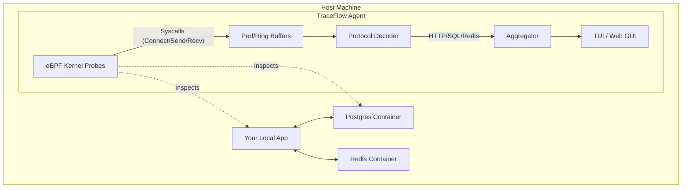
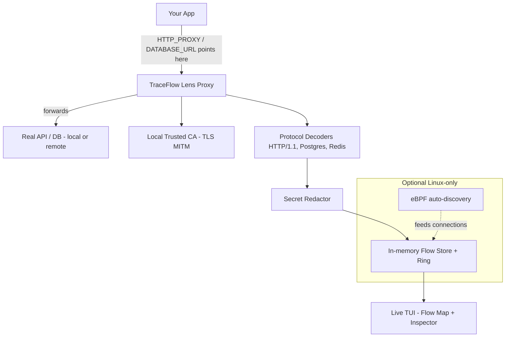
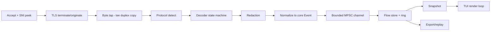

# Phase 1: 100 Concrete Project Ideas

1. **HyperBus**
   - **One-sentence description**: A high-performance, cross-platform IPC system using shared-memory ring buffers.
   - **Problem solved**: Inter-process communication latency in real-time systems.
   - **Current alternatives**: gRPC, ZeroMQ, Unix Sockets.
   - **Why insufficient**: High syscall overhead and serialization latency.
   - **Target users**: Systems engineers, high-frequency trading devs, media engine devs.
   - **Implementation difficulty**: 8
   - **Maintenance burden**: 5
   - **GitHub star potential**: 9
   - **Originality**: 7

2. **GhostWire**
   - **One-sentence description**: A WireGuard-compatible mesh VPN using libp2p for automatic discovery and NAT traversal.
   - **Problem solved**: Complex setup and centralization of mesh VPNs.
   - **Current alternatives**: Tailscale, ZeroTier, Netmaker.
   - **Why insufficient**: Tailscale's control plane is closed-source; others are centralized or complex to self-host.
   - **Target users**: SREs, remote teams, home lab enthusiasts.
   - **Implementation difficulty**: 7
   - **Maintenance burden**: 7
   - **GitHub star potential**: 10
   - **Originality**: 8

3. **TraceFlow**
   - **One-sentence description**: System-wide execution tracer using eBPF to visualize data flow across processes and network.
   - **Problem solved**: Difficulty in debugging "invisible" interactions between microservices on a single host.
   - **Current alternatives**: Jaeger, Strace, Wireshark.
   - **Why insufficient**: Jaeger requires instrumentation; Strace is slow; Wireshark is too low-level.
   - **Target users**: Backend engineers, performance engineers, security researchers.
   - **Implementation difficulty**: 9
   - **Maintenance burden**: 5
   - **GitHub star potential**: 10
   - **Originality**: 9

4. **NitroKey**
   - **One-sentence description**: A high-performance key-value store that runs entirely in the Linux kernel via eBPF.
   - **Problem solved**: Overhead of user-to-kernel context switching for high-throughput KV operations.
   - **Current alternatives**: Redis, Memcached, RocksDB.
   - **Why insufficient**: Context switching and network stack overhead limit max IOPS.
   - **Target users**: Database engineers, high-scale web infrastructure.
   - **Implementation difficulty**: 9
   - **Maintenance burden**: 6
   - **GitHub star potential**: 9
   - **Originality**: 9

5. **Cellular**
   - **One-sentence description**: A decentralized application fabric for deploying stateful WASM "cells" across a P2P mesh.
   - **Problem solved**: Dependence on centralized cloud providers for compute and state.
   - **Current alternatives**: Kubernetes, Lambda, IPFS (storage only).
   - **Why insufficient**: K8s is complex; Lambda is locked-in; IPFS lacks generic compute/state sync.
   - **Target users**: Decentralized app devs, edge computing engineers.
   - **Implementation difficulty**: 10
   - **Maintenance burden**: 8
   - **GitHub star potential**: 10
   - **Originality**: 9

6. **HermitVM**
   - **One-sentence description**: A container runtime that uses hardware virtualization (micro-VMs) with 1-second cold starts.
   - **Problem solved**: Weak isolation of standard containers and slow boot of traditional VMs.
   - **Current alternatives**: Firecracker, Kata Containers, Docker.
   - **Why insufficient**: Firecracker is hard to use; Kata is heavy; Docker lacks hardware isolation.
   - **Target users**: Platform engineers, security-conscious cloud providers.
   - **Implementation difficulty**: 8
   - **Maintenance burden**: 6
   - **GitHub star potential**: 9
   - **Originality**: 7

7. **ShadowRoot**
   - **One-sentence description**: A capability-based security layer for Linux that replaces sudo with fine-grained, temporary permissions.
   - **Problem solved**: The "all-or-nothing" security model of root and sudo.
   - **Current alternatives**: sudo, doas, Polkit.
   - **Why insufficient**: Polkit is complex; sudo is prone to privilege escalation and lack of granularity.
   - **Target users**: System administrators, security engineers.
   - **Implementation difficulty**: 7
   - **Maintenance burden**: 5
   - **GitHub star potential**: 9
   - **Originality**: 8

8. **FluxDB**
   - **One-sentence description**: A time-series database optimized for high-cardinality data using a new "LSM-Trie" index.
   - **Problem solved**: Performance degradation in time-series DBs when dealing with many unique tags/labels.
   - **Current alternatives**: InfluxDB, Prometheus, VictoriaMetrics.
   - **Why insufficient**: High memory usage or slow queries at extreme cardinality levels.
   - **Target users**: Monitoring engineers, IoT developers.
   - **Implementation difficulty**: 9
   - **Maintenance burden**: 6
   - **GitHub star potential**: 8
   - **Originality**: 8

9. **TelePort**
   - **One-sentence description**: Live process migration tool that "teleports" running binaries between machines without losing state.
   - **Problem solved**: Inability to move workloads between servers without downtime or connection loss.
   - **Current alternatives**: CRIU, Kubernetes (restarts).
   - **Why insufficient**: CRIU is hard to integrate; K8s restarts processes, losing ephemeral state and connections.
   - **Target users**: SREs, cloud operators, game server hosters.
   - **Implementation difficulty**: 10
   - **Maintenance burden**: 7
   - **GitHub star potential**: 10
   - **Originality**: 9

10. **ZeroTrust-Proxy**
    - **One-sentence description**: A transparent proxy that injects mTLS and identity-based access control into legacy TCP services.
    - **Problem solved**: Difficulty in upgrading legacy infrastructure to modern Zero Trust standards.
    - **Current alternatives**: Istio, Linkerd, Cloudflare Tunnel.
    - **Why insufficient**: Istio is massive; Cloudflare is proprietary; others require complex sidecar management.
    - **Target users**: Enterprise security teams, DevOps.
    - **Implementation difficulty**: 8
    - **Maintenance burden**: 6
    - **GitHub star potential**: 9
    - **Originality**: 7

11. **IronVault**
    - **One-sentence description**: Hardware-backed secret management using TPMs and Enclaves.
    - **Problem solved**: Secrets stored in memory or on disk are vulnerable to memory dumps or extraction.
    - **Current alternatives**: HashiCorp Vault, AWS Secrets Manager.
    - **Why insufficient**: Cloud-dependent or don't use local hardware root-of-trust effectively.
    - **Target users**: Security engineers, DevOps.
    - **Implementation difficulty**: 9
    - **Maintenance burden**: 6
    - **GitHub star potential**: 10
    - **Originality**: 8

12. **Z-Sync**
    - **One-sentence description**: Differential file sync engine optimized for large binary blobs using content-defined chunking.
    - **Problem solved**: Rsync is slow on large binaries; Dropbox/others are centralized and limited.
    - **Current alternatives**: rsync, Syncthing, Rclone.
    - **Why insufficient**: Lack of optimization for modern NVMe and heavy binary data (game assets, ML models).
    - **Target users**: Data scientists, game developers, backup admins.
    - **Implementation difficulty**: 6
    - **Maintenance burden**: 4
    - **GitHub star potential**: 8
    - **Originality**: 6

13. **Proto-Fuzz**
    - **One-sentence description**: A protocol-aware fuzzer that understands Protobuf/gRPC to find logic bugs.
    - **Problem solved**: Standard fuzzers are "dumb" and fail to explore deep protocol logic.
    - **Current alternatives**: AFL++, LibFuzzer.
    - **Why insufficient**: Requires complex manual setup for structured protocols.
    - **Target users**: QA engineers, security researchers.
    - **Implementation difficulty**: 8
    - **Maintenance burden**: 5
    - **GitHub star potential**: 8
    - **Originality**: 7

14. **Safe-Kernel-SDK**
    - **One-sentence description**: A library for writing safe and performant Linux kernel modules in Rust.
    - **Problem solved**: Complexity and danger (panics/memory safety) of writing C-based kernel modules.
    - **Current alternatives**: C, Rust for Linux (mainline).
    - **Why insufficient**: Mainline Rust for Linux is still early and hard to use for external modules.
    - **Target users**: System developers, driver authors.
    - **Implementation difficulty**: 9
    - **Maintenance burden**: 7
    - **GitHub star potential**: 10
    - **Originality**: 7

15. **Query-Genie**
    - **One-sentence description**: An automated SQL optimizer that suggests indexes and schema changes based on live query plans.
    - **Problem solved**: Manual performance tuning of SQL queries is tedious and error-prone.
    - **Current alternatives**: Database-specific tuners, manual EXPLAIN analysis.
    - **Why insufficient**: Often too generic or require deep database expertise.
    - **Target users**: Backend developers, DBAs.
    - **Implementation difficulty**: 7
    - **Maintenance burden**: 5
    - **GitHub star potential**: 9
    - **Originality**: 8

16. **Task-Orch-Local**
    - **One-sentence description**: A lightweight, decentralized task orchestrator for local clusters and home labs.
    - **Problem solved**: K8s is too heavy for small-scale orchestration.
    - **Current alternatives**: K3s, Nomad.
    - **Why insufficient**: Still require significant setup and overhead for small clusters.
    - **Target users**: Home lab enthusiasts, small teams.
    - **Implementation difficulty**: 7
    - **Maintenance burden**: 6
    - **GitHub star potential**: 9
    - **Originality**: 6

17. **Code-Map-3D**
    - **One-sentence description**: A 3D interactive visualization of codebase dependencies and architecture.
    - **Problem solved**: Understanding large, complex codebases is difficult.
    - **Current alternatives**: Dependency graphs (2D), IDE outline.
    - **Why insufficient**: 2D graphs become unreadable quickly; IDE outlines lack structural context.
    - **Target users**: New hires, architects, open source contributors.
    - **Implementation difficulty**: 6
    - **Maintenance burden**: 4
    - **GitHub star potential**: 9
    - **Originality**: 8

18. **Bin-Diff-Pro**
    - **One-sentence description**: Advanced binary diffing tool that identifies structural changes in compiled code.
    - **Problem solved**: Comparing binaries to find security fixes or identify patches is difficult.
    - **Current alternatives**: BinDiff, Diaphora.
    - **Why insufficient**: Proprietary or difficult to script and automate.
    - **Target users**: Security researchers, malware analysts.
    - **Implementation difficulty**: 8
    - **Maintenance burden**: 5
    - **GitHub star potential**: 8
    - **Originality**: 7

19. **Network-Chaos**
    - **One-sentence description**: A chaos engineering tool specifically for simulating network partitions and latency.
    - **Problem solved**: Testing distributed system resilience to network failures is hard.
    - **Current alternatives**: Chaos Mesh, Gremlin.
    - **Why insufficient**: Chaos Mesh is K8s-only; Gremlin is proprietary.
    - **Target users**: SREs, backend engineers.
    - **Implementation difficulty**: 7
    - **Maintenance burden**: 5
    - **GitHub star potential**: 9
    - **Originality**: 7

20. **Fast-BFS**
    - **One-sentence description**: A block-level filesystem designed for ultra-low latency flash storage.
    - **Problem solved**: Traditional filesystems (ext4/xfs) add significant overhead to modern fast storage.
    - **Current alternatives**: ext4, xfs, ZFS, F2FS.
    - **Why insufficient**: Not optimized for the sub-millisecond latencies of modern NVMe drives.
    - **Target users**: Storage engineers, database authors.
    - **Implementation difficulty**: 9
    - **Maintenance burden**: 7
    - **GitHub star potential**: 8
    - **Originality**: 8

21. **Identity-Proxy**
    - **One-sentence description**: Adds modern OIDC/OAuth2 authentication to legacy apps via a transparent proxy.
    - **Problem solved**: Implementing authentication in every app is repetitive and error-prone.
    - **Current alternatives**: Authelia, Keycloak.
    - **Why insufficient**: Keycloak is massive; Authelia is complex to configure for multiple apps.
    - **Target users**: Enterprise developers, sysadmins.
    - **Implementation difficulty**: 7
    - **Maintenance burden**: 5
    - **GitHub star potential**: 9
    - **Originality**: 6

22. **Stream-Store**
    - **One-sentence description**: A database optimized for high-throughput, append-only streams (like Kafka but simpler).
    - **Problem solved**: Kafka is complex to manage; simple logs are hard to query.
    - **Current alternatives**: Kafka, Redpanda, NATS.
    - **Why insufficient**: High operational complexity for simple streaming needs.
    - **Target users**: Backend engineers, data engineers.
    - **Implementation difficulty**: 8
    - **Maintenance burden**: 6
    - **GitHub star potential**: 8
    - **Originality**: 7

23. **Hot-Patch-Tool**
    - **One-sentence description**: Allows hot-patching running binaries without restarts using process injection.
    - **Problem solved**: Downtime caused by minor code updates or security patches.
    - **Current alternatives**: kpatch (kernel), manual process injection.
    - **Why insufficient**: kpatch is kernel-only; others are experimental and unstable.
    - **Target users**: SREs, system admins.
    - **Implementation difficulty**: 9
    - **Maintenance burden**: 6
    - **GitHub star potential**: 9
    - **Originality**: 8

24. **Mesh-DNS**
    - **One-sentence description**: A decentralized DNS system for local and mesh networks.
    - **Problem solved**: Centralized DNS is a single point of failure and lacks privacy.
    - **Current alternatives**: CoreDNS, BIND, mDNS.
    - **Why insufficient**: mDNS doesn't scale; others are centralized.
    - **Target users**: Mesh network enthusiasts, privacy advocates.
    - **Implementation difficulty**: 7
    - **Maintenance burden**: 5
    - **GitHub star potential**: 8
    - **Originality**: 7

25. **Secret-Scanner-Memory**
    - **One-sentence description**: Scans for secrets in memory, swap, and environment variables of running processes.
    - **Problem solved**: Secrets often leak into memory and remain there indefinitely.
    - **Current alternatives**: gitleaks (static), Trufflehog (static).
    - **Why insufficient**: Static scanners miss runtime leaks.
    - **Target users**: Security engineers, auditors.
    - **Implementation difficulty**: 8
    - **Maintenance burden**: 5
    - **GitHub star potential**: 9
    - **Originality**: 8

26. **Namespace-Sandbox**
    - **One-sentence description**: Easy-to-use sandboxing for any application using Linux namespaces.
    - **Problem solved**: Creating secure sandboxes for untrusted code is complex.
    - **Current alternatives**: Firejail, bubblewrap.
    - **Why insufficient**: Firejail is complex; bubblewrap is too low-level.
    - **Target users**: Developers running untrusted code, security researchers.
    - **Implementation difficulty**: 7
    - **Maintenance burden**: 5
    - **GitHub star potential**: 9
    - **Originality**: 6

27. **Perf-Lens-PMU**
    - **One-sentence description**: A continuous profiler that uses hardware performance counters (PMU) for zero-overhead profiling.
    - **Problem solved**: Standard profilers add significant overhead to production systems.
    - **Current alternatives**: gprof, perf, pyroscope.
    - **Why insufficient**: pyroscope uses sampling (higher overhead); perf is hard to visualize.
    - **Target users**: Performance engineers, SREs.
    - **Implementation difficulty**: 9
    - **Maintenance burden**: 6
    - **GitHub star potential**: 9
    - **Originality**: 8

28. **Sync-Vault-P2P**
    - **One-sentence description**: Encrypted file sync with multi-device support and no central server.
    - **Problem solved**: Privacy concerns and centralization of cloud storage.
    - **Current alternatives**: Syncthing, Nextcloud.
    - **Why insufficient**: Syncthing can be hard to setup; Nextcloud is centralized.
    - **Target users**: Privacy-conscious users, small teams.
    - **Implementation difficulty**: 8
    - **Maintenance burden**: 6
    - **GitHub star potential**: 9
    - **Originality**: 7

29. **XDP-Firewall**
    - **One-sentence description**: A high-performance firewall using XDP for million-packet-per-second filtering.
    - **Problem solved**: Traditional firewalls (iptables) are too slow for high-throughput networks.
    - **Current alternatives**: iptables, nftables, pf.
    - **Why insufficient**: Higher latency and lower throughput at scale.
    - **Target users**: Network engineers, cloud providers.
    - **Implementation difficulty**: 8
    - **Maintenance burden**: 5
    - **GitHub star potential**: 9
    - **Originality**: 8

30. **Formal-Spec-Auto**
    - **One-sentence description**: Automatically generates formal specifications and property-based tests from unit tests.
    - **Problem solved**: Writing formal specs is difficult and time-consuming.
    - **Current alternatives**: TLA+, Coq (manual).
    - **Why insufficient**: Requires deep mathematical expertise.
    - **Target users**: Software engineers, QA engineers.
    - **Implementation difficulty**: 9
    - **Maintenance burden**: 6
    - **GitHub star potential**: 8
    - **Originality**: 9

31. **Heap-Vision-Live**
    - **One-sentence description**: Visualizes the heap in real-time to find memory leaks and fragmentation.
    - **Problem solved**: Debugging memory issues in complex applications is difficult.
    - **Current alternatives**: Valgrind, heaptrack.
    - **Why insufficient**: Valgrind is slow; heaptrack is not real-time.
    - **Target users**: C/C++/Rust developers.
    - **Implementation difficulty**: 8
    - **Maintenance burden**: 5
    - **GitHub star potential**: 9
    - **Originality**: 8

32. **Mesh-Build-Local**
    - **One-sentence description**: Distributes builds across a mesh of developer machines to reduce build times.
    - **Problem solved**: Long build times in large projects.
    - **Current alternatives**: distcc, Incredibuild.
    - **Why insufficient**: distcc is hard to configure; Incredibuild is proprietary.
    - **Target users**: Software engineers, DevOps.
    - **Implementation difficulty**: 8
    - **Maintenance burden**: 6
    - **GitHub star potential**: 9
    - **Originality**: 7

33. **P2P-Key-Manager**
    - **One-sentence description**: Decentralized SSH key management and distribution.
    - **Problem solved**: Managing SSH keys across many servers and users is a security risk.
    - **Current alternatives**: Vault, Teleport.
    - **Why insufficient**: Require central servers and complex infrastructure.
    - **Target users**: Sysadmins, SREs.
    - **Implementation difficulty**: 7
    - **Maintenance burden**: 5
    - **GitHub star potential**: 9
    - **Originality**: 7

34. **WasmShell-Safe**
    - **One-sentence description**: A Unix-like shell where every command is a sandboxed WASM module.
    - **Problem solved**: Running arbitrary shell commands is insecure.
    - **Current alternatives**: bash, zsh, fish.
    - **Why insufficient**: No built-in sandboxing or isolation.
    - **Target users**: Security-conscious developers, educators.
    - **Implementation difficulty**: 8
    - **Maintenance burden**: 6
    - **GitHub star potential**: 9
    - **Originality**: 9

35. **Branch-DB-SQL**
    - **One-sentence description**: Allows instant branching and merging of SQL databases for development.
    - **Problem solved**: Managing database state across different branches is difficult.
    - **Current alternatives**: Manual migration, Dolt.
    - **Why insufficient**: Dolt is a separate database; others are manual and error-prone.
    - **Target users**: Backend developers, DBAs.
    - **Implementation difficulty**: 9
    - **Maintenance burden**: 7
    - **GitHub star potential**: 9
    - **Originality**: 8

36. **Audit-Chain-Log**
    - **One-sentence description**: Tamper-proof system logs stored in an authenticated data structure.
    - **Problem solved**: System logs can be easily modified or deleted by attackers.
    - **Current alternatives**: syslog, journald.
    - **Why insufficient**: No built-in tamper detection or immutability.
    - **Target users**: Security engineers, auditors.
    - **Implementation difficulty**: 8
    - **Maintenance burden**: 5
    - **GitHub star potential**: 9
    - **Originality**: 8

37. **Net-Snapshot-Viz**
    - **One-sentence description**: Captures the state of all network connections for debugging.
    - **Problem solved**: Visualizing complex network interactions is difficult.
    - **Current alternatives**: netstat, ss, tcpdump.
    - **Why insufficient**: Provide text output that is hard to parse for complex scenarios.
    - **Target users**: Network engineers, backend developers.
    - **Implementation difficulty**: 7
    - **Maintenance burden**: 4
    - **GitHub star potential**: 8
    - **Originality**: 7

38. **Fs-Event-Mesh**
    - **One-sentence description**: High-performance, cross-platform file system event aggregator.
    - **Problem solved**: Watching for file events across different platforms is inconsistent and inefficient.
    - **Current alternatives**: inotify, fsevents, notify-rs.
    - **Why insufficient**: notify-rs is great but lacks an aggregator for multiple hosts.
    - **Target users**: System developers, tool authors.
    - **Implementation difficulty**: 7
    - **Maintenance burden**: 5
    - **GitHub star potential**: 8
    - **Originality**: 6

39. **Process-Freeze-Restore**
    - **One-sentence description**: Saves the full state of a process to disk and restores it later.
    - **Problem solved**: Long-running processes can be lost due to restarts or crashes.
    - **Current alternatives**: CRIU.
    - **Why insufficient**: CRIU is difficult to integrate and has many limitations.
    - **Target users**: Developers, SREs.
    - **Implementation difficulty**: 10
    - **Maintenance burden**: 8
    - **GitHub star potential**: 9
    - **Originality**: 7

40. **Micro-Service-Fail-Sim**
    - **One-sentence description**: Simulates complex microservice failures on a single machine.
    - **Problem solved**: Testing resilience to failures in a microservices architecture is hard.
    - **Current alternatives**: Chaos Mesh, Gremlin.
    - **Why insufficient**: Require complex setup and multiple machines.
    - **Target users**: Backend engineers, QA engineers.
    - **Implementation difficulty**: 7
    - **Maintenance burden**: 5
    - **GitHub star potential**: 9
    - **Originality**: 7

41. **Api-Diff-Breaking**
    - **One-sentence description**: Detects breaking changes in APIs by comparing OpenAPI/Protobuf specs.
    - **Problem solved**: Breaking API changes often go unnoticed until production.
    - **Current alternatives**: Manual review, spectral.
    - **Why insufficient**: Manual review is error-prone; spectral is just a linter.
    - **Target users**: API developers, QA engineers.
    - **Implementation difficulty**: 6
    - **Maintenance burden**: 4
    - **GitHub star potential**: 8
    - **Originality**: 6

42. **Data-Mask-Pro**
    - **One-sentence description**: Automatically anonymizes production data for development use.
    - **Problem solved**: Using production data in dev environments is a security risk.
    - **Current alternatives**: Manual scripts, proprietary tools.
    - **Why insufficient**: Manual scripts are hard to maintain; proprietary tools are expensive.
    - **Target users**: Security engineers, backend developers.
    - **Implementation difficulty**: 7
    - **Maintenance burden**: 5
    - **GitHub star potential**: 9
    - **Originality**: 7

43. **Perf-Bench-Grid**
    - **One-sentence description**: Distributed benchmarking across different hardware profiles.
    - **Problem solved**: Benchmarking on a single machine doesn't represent real-world diversity.
    - **Current alternatives**: JMeter, k6 (mostly load testing).
    - **Why insufficient**: Don't easily support benchmarking across different CPU/RAM/Disk profiles.
    - **Target users**: Performance engineers, library authors.
    - **Implementation difficulty**: 8
    - **Maintenance burden**: 6
    - **GitHub star potential**: 8
    - **Originality**: 7

44. **Auto-Storage-Tier**
    - **One-sentence description**: Automatically moves data between SSD, HDD, and Cloud based on access patterns.
    - **Problem solved**: Managing data placement manually is tedious and inefficient.
    - **Current alternatives**: ZFS (L2ARC), cloud-specific tiering.
    - **Why insufficient**: ZFS is specific; cloud tiering is expensive and locked-in.
    - **Target users**: Sysadmins, data engineers.
    - **Implementation difficulty**: 8
    - **Maintenance burden**: 6
    - **GitHub star potential**: 8
    - **Originality**: 7

45. **Mesh-Packet-Tap**
    - **One-sentence description**: A distributed network tap for capturing traffic across a cluster.
    - **Problem solved**: Capturing traffic across multiple nodes is difficult.
    - **Current alternatives**: tcpdump, Wireshark.
    - **Why insufficient**: Don't support distributed capture and aggregation easily.
    - **Target users**: Network engineers, security researchers.
    - **Implementation difficulty**: 8
    - **Maintenance burden**: 5
    - **GitHub star potential**: 9
    - **Originality**: 8

46. **Debt-Lens-History**
    - **One-sentence description**: Visualizes code history and complexity to identify areas of high technical debt.
    - **Problem solved**: Technical debt is often hidden and hard to prioritize.
    - **Current alternatives**: SonarQube, CodeClimate.
    - **Why insufficient**: Provide static metrics without historical context of changes.
    - **Target users**: Architects, engineering managers.
    - **Implementation difficulty**: 7
    - **Maintenance burden**: 5
    - **GitHub star potential**: 8
    - **Originality**: 7

47. **Secret-Inject-Env**
    - **One-sentence description**: Securely injects secrets into environment variables at runtime.
    - **Problem solved**: Secrets stored in env files or CI/CD are often insecure.
    - **Current alternatives**: envchain, doppler.
    - **Why insufficient**: doppler is proprietary; envchain is limited.
    - **Target users**: Developers, DevOps.
    - **Implementation difficulty**: 6
    - **Maintenance burden**: 4
    - **GitHub star potential**: 9
    - **Originality**: 6

48. **Column-Log-Search**
    - **One-sentence description**: High-performance log search engine using columnar storage.
    - **Problem solved**: Searching through massive logs is slow and resource-intensive.
    - **Current alternatives**: Elasticsearch, Loki.
    - **Why insufficient**: Elasticsearch is resource-heavy; Loki can be slow for complex queries.
    - **Target users**: SREs, backend developers.
    - **Implementation difficulty**: 9
    - **Maintenance burden**: 6
    - **GitHub star potential**: 9
    - **Originality**: 8

49. **Hardware-Failure-Predict**
    - **One-sentence description**: Predictive failure analysis for hardware using SMART and sensor data.
    - **Problem solved**: Hardware failures often occur without warning, causing downtime.
    - **Current alternatives**: smartmontools, manufacturer-specific tools.
    - **Why insufficient**: Don't provide cross-platform predictive analysis.
    - **Target users**: Sysadmins, data center operators.
    - **Implementation difficulty**: 8
    - **Maintenance burden**: 6
    - **GitHub star potential**: 8
    - **Originality**: 7

50. **Universal-Pkg-Mirror**
   - **One-sentence description**: Syncs and caches packages from multiple package managers for offline use.
   - **Problem solved**: Developing without a reliable internet connection is hard.
   - **Current alternatives**: verdaccio, Nexus.
   - **Why insufficient**: Require complex setup and don't support all package managers.
   - **Target users**: Developers in remote areas, enterprise developers.
   - **Implementation difficulty**: 7
   - **Maintenance burden**: 5
   - **GitHub star potential**: 8
   - **Originality**: 6

51. **Cloud-Infra-Lint**
    - **One-sentence description**: Scans infrastructure-as-code for security and cost issues.
    - **Problem solved**: Misconfigured cloud infra leads to security breaches and high costs.
    - **Current alternatives**: Checkov, TFLint.
    - **Why insufficient**: Often miss complex cost-related misconfigurations.
    - **Target users**: DevOps, SREs.
    - **Implementation difficulty**: 6
    - **Maintenance burden**: 5
    - **GitHub star potential**: 8
    - **Originality**: 6

52. **Resource-Quota-Mesh**
    - **One-sentence description**: Enforces resource usage quotas across a multi-tenant cluster.
    - **Problem solved**: One tenant can monopolize resources in a shared cluster.
    - **Current alternatives**: K8s ResourceQuotas.
    - **Why insufficient**: Hard to manage across multiple clusters or non-K8s environments.
    - **Target users**: Platform engineers, sysadmins.
    - **Implementation difficulty**: 8
    - **Maintenance burden**: 6
    - **GitHub star potential**: 8
    - **Originality**: 7

53. **Edge-API-Gateway**
    - **One-sentence description**: A lightweight, programmable API gateway optimized for edge computing.
    - **Problem solved**: Standard API gateways are too heavy for edge devices.
    - **Current alternatives**: Kong, Tyk.
    - **Why insufficient**: High resource consumption and complex configuration.
    - **Target users**: Edge computing developers, IoT engineers.
    - **Implementation difficulty**: 8
    - **Maintenance burden**: 6
    - **GitHub star potential**: 9
    - **Originality**: 8

54. **High-Perf-Dist-Lock**
    - **One-sentence description**: A high-performance, distributed lock manager for local area networks.
    - **Problem solved**: Coordinating access to shared resources in a distributed system is slow.
    - **Current alternatives**: Redis (Redlock), ZooKeeper.
    - **Why insufficient**: High latency for lock acquisition and release.
    - **Target users**: Backend engineers, distributed systems devs.
    - **Implementation difficulty**: 9
    - **Maintenance burden**: 6
    - **GitHub star potential**: 8
    - **Originality**: 8

55. **P2P-Scrape-Mesh**
    - **One-sentence description**: Distributed web scraping using a mesh of nodes to overcome rate limits.
    - **Problem solved**: Web scrapers often get blocked or rate-limited.
    - **Current alternatives**: Proxy services, Scrapy.
    - **Why insufficient**: Proxy services are expensive; Scrapy is single-node by default.
    - **Target users**: Data scientists, web developers.
    - **Implementation difficulty**: 7
    - **Maintenance burden**: 6
    - **GitHub star potential**: 9
    - **Originality**: 7

56. **API-Traffic-Profiler**
    - **One-sentence description**: Analyzes API traffic patterns to identify bottlenecks and anomalies in real-time.
    - **Problem solved**: Identifying performance issues in APIs is difficult without deep tracing.
    - **Current alternatives**: Akita, Wireshark.
    - **Why insufficient**: Akita is proprietary; Wireshark is too low-level.
    - **Target users**: Backend engineers, SREs.
    - **Implementation difficulty**: 8
    - **Maintenance burden**: 5
    - **GitHub star potential**: 9
    - **Originality**: 8

57. **Secure-Link-Protocol**
    - **One-sentence description**: A modern, decentralized, and metadata-private communication protocol.
    - **Problem solved**: Existing protocols leak metadata or rely on central servers.
    - **Current alternatives**: Matrix, Signal.
    - **Why insufficient**: Matrix is complex and metadata-heavy; Signal is centralized.
    - **Target users**: Privacy advocates, developers building secure apps.
    - **Implementation difficulty**: 9
    - **Maintenance burden**: 7
    - **GitHub star potential**: 10
    - **Originality**: 9

58. **ID-Verif-Hardware**
    - **One-sentence description**: SDK for secure identity verification using hardware-backed certificates.
    - **Problem solved**: Software-based identity is easily spoofed or stolen.
    - **Current alternatives**: WebAuthn, OAuth.
    - **Why insufficient**: WebAuthn is limited to browsers; OAuth relies on central providers.
    - **Target users**: Security engineers, app developers.
    - **Implementation difficulty**: 8
    - **Maintenance burden**: 6
    - **GitHub star potential**: 9
    - **Originality**: 8

59. **Container-Layer-Squeezer**
    - **One-sentence description**: Optimizes and shrinks container images by removing unused files and layers.
    - **Problem solved**: Large container images slow down deployments and increase storage costs.
    - **Current alternatives**: Docker Slim, multi-stage builds.
    - **Why insufficient**: multi-stage builds are manual; Docker Slim can break images.
    - **Target users**: DevOps, platform engineers.
    - **Implementation difficulty**: 7
    - **Maintenance burden**: 5
    - **GitHub star potential**: 9
    - **Originality**: 7

60. **Web-Perf-Live-Trace**
    - **One-sentence description**: Real-time monitoring and tracing of web application performance in production.
    - **Problem solved**: Understanding performance bottlenecks in live web apps is hard.
    - **Current alternatives**: New Relic, Datadog.
    - **Why insufficient**: Expensive and proprietary.
    - **Target users**: Web developers, SREs.
    - **Implementation difficulty**: 8
    - **Maintenance burden**: 6
    - **GitHub star potential**: 9
    - **Originality**: 7

61. **API-Spec-Inference**
    - **One-sentence description**: Automatically generates API specifications from observed traffic and code.
    - **Problem solved**: Keeping API documentation up-to-date is a constant struggle.
    - **Current alternatives**: Swagger, manual doc.
    - **Why insufficient**: Swagger requires manual annotations; manual doc is always outdated.
    - **Target users**: API developers, QA engineers.
    - **Implementation difficulty**: 8
    - **Maintenance burden**: 5
    - **GitHub star potential**: 9
    - **Originality**: 8

62. **Zero-Downtime-Data-Migrate**
    - **One-sentence description**: High-performance tool for migrating data between disparate database systems.
    - **Problem solved**: Migrating data between databases often causes downtime or data loss.
    - **Current alternatives**: AWS DMS, manual scripts.
    - **Why insufficient**: AWS DMS is cloud-locked; manual scripts are risky and slow.
    - **Target users**: DBAs, backend engineers.
    - **Implementation difficulty**: 9
    - **Maintenance burden**: 7
    - **GitHub star potential**: 9
    - **Originality**: 7

63. **Cluster-Policy-Enforce**
    - **One-sentence description**: Centralized management and enforcement of security policies across a cluster.
    - **Problem solved**: Enforcing consistent security policies across many machines is difficult.
    - **Current alternatives**: OPA, Kyverno.
    - **Why insufficient**: OPA is complex; Kyverno is K8s-only.
    - **Target users**: Security engineers, sysadmins.
    - **Implementation difficulty**: 8
    - **Maintenance burden**: 6
    - **GitHub star potential**: 8
    - **Originality**: 7

64. **Lightweight-Edge-Scheduler**
    - **One-sentence description**: A lightweight task scheduler designed for resource-constrained edge devices.
    - **Problem solved**: Existing schedulers (K8s) are too heavy for edge hardware.
    - **Current alternatives**: K3s, Nomad.
    - **Why insufficient**: Still too much overhead for very small devices.
    - **Target users**: IoT engineers, edge computing developers.
    - **Implementation difficulty**: 8
    - **Maintenance burden**: 6
    - **GitHub star potential**: 9
    - **Originality**: 8

65. **Stateful-Mock-Generator**
    - **One-sentence description**: Generates realistic, stateful mock servers from API specifications.
    - **Problem solved**: Stateless mocks fail to catch bugs related to data flow and state changes.
    - **Current alternatives**: Mockoon, Prism.
    - **Why insufficient**: Mostly stateless and require manual state management.
    - **Target users**: QA engineers, frontend developers.
    - **Implementation difficulty**: 7
    - **Maintenance burden**: 5
    - **GitHub star potential**: 9
    - **Originality**: 8

66. **Network-Health-Graph**
    - **One-sentence description**: Visualizes the dynamic network topology and service health of a cluster.
    - **Problem solved**: Understanding the health of a complex distributed system is hard.
    - **Current alternatives**: Kiali, Grafana.
    - **Why insufficient**: Kiali is Istio-only; Grafana requires manual dashboard setup.
    - **Target users**: SREs, backend engineers.
    - **Implementation difficulty**: 7
    - **Maintenance burden**: 5
    - **GitHub star potential**: 9
    - **Originality**: 7

67. **Complexity-Heatmap-Pro**
    - **One-sentence description**: A heatmap visualization of code complexity over the project's source tree.
    - **Problem solved**: Identifying the most complex parts of a codebase is difficult from text alone.
    - **Current alternatives**: SonarQube, IDE complexity plugins.
    - **Why insufficient**: Lack visual impact and cross-project comparison.
    - **Target users**: Architects, new developers.
    - **Implementation difficulty**: 6
    - **Maintenance burden**: 4
    - **GitHub star potential**: 9
    - **Originality**: 7

68. **Persistent-Dist-Queue**
    - **One-sentence description**: A high-performance, persistent distributed queue for microservices.
    - **Problem solved**: Coordinating tasks between services with high reliability is hard.
    - **Current alternatives**: RabbitMQ, Kafka.
    - **Why insufficient**: operational complexity and resource overhead.
    - **Target users**: Backend engineers, system architects.
    - **Implementation difficulty**: 9
    - **Maintenance burden**: 7
    - **GitHub star potential**: 8
    - **Originality**: 7

69. **Log-Ingest-Gossip**
    - **One-sentence description**: A distributed mesh for high-volume log ingestion using gossip protocols.
    - **Problem solved**: Centralized log ingestion can become a bottleneck.
    - **Current alternatives**: Fluentd, Logstash.
    - **Why insufficient**: Rely on central aggregators which can fail or lag.
    - **Target users**: SREs, infrastructure engineers.
    - **Implementation difficulty**: 9
    - **Maintenance burden**: 6
    - **GitHub star potential**: 9
    - **Originality**: 9

70. **Api-Security-Audit**
    - **One-sentence description**: Scans APIs for common vulnerabilities and adherence to security best practices.
    - **Problem solved**: API security is often overlooked during development.
    - **Current alternatives**: OWASP ZAP, manual testing.
    - **Why insufficient**: ZAP is generic; manual testing is slow.
    - **Target users**: Security engineers, API developers.
    - **Implementation difficulty**: 7
    - **Maintenance burden**: 5
    - **GitHub star potential**: 9
    - **Originality**: 7

71. **Terminal-Viz-Library**
    - **One-sentence description**: A high-performance library for creating interactive data visualizations in the terminal.
    - **Problem solved**: Creating beautiful visualizations in the TUI is difficult.
    - **Current alternatives**: bubbletea, tui-rs.
    - **Why insufficient**: Mostly focused on UI components, not data visualization (charts, maps).
    - **Target users**: CLI tool authors, data scientists.
    - **Implementation difficulty**: 7
    - **Maintenance burden**: 5
    - **GitHub star potential**: 9
    - **Originality**: 8

72. **Net-Emu-Library**
    - **One-sentence description**: A library for emulating various network conditions in tests.
    - **Problem solved**: Testing app behavior under poor network conditions is hard to automate.
    - **Current alternatives**: tc (Linux), toxiproxy.
    - **Why insufficient**: tc is hard to use; toxiproxy requires a separate process.
    - **Target users**: QA engineers, backend developers.
    - **Implementation difficulty**: 7
    - **Maintenance burden**: 5
    - **GitHub star potential**: 9
    - **Originality**: 7

73. **High-Speed-Loc-Search**
    - **One-sentence description**: High-performance, local search engine for large source code repositories.
    - **Problem solved**: Searching through millions of lines of code is slow with standard tools.
    - **Current alternatives**: ripgrep, Sourcegraph.
    - **Why insufficient**: ripgrep is grep-only; Sourcegraph is often cloud-based.
    - **Target users**: Developers working on massive mono-repos.
    - **Implementation difficulty**: 8
    - **Maintenance burden**: 6
    - **GitHub star potential**: 9
    - **Originality**: 8

74. **Eventual-KV-Mesh**
    - **One-sentence description**: A high-performance, distributed key-value store with eventual consistency.
    - **Problem solved**: Strong consistency is often too slow for edge/P2P apps.
    - **Current alternatives**: Cassandra, DynamoDB.
    - **Why insufficient**: High operational complexity for P2P/edge use cases.
    - **Target users**: DApp developers, edge computing engineers.
    - **Implementation difficulty**: 9
    - **Maintenance burden**: 7
    - **GitHub star potential**: 8
    - **Originality**: 8

75. **Interactive-Doc-Gen**
    - **One-sentence description**: Generates rich, interactive documentation from API specs and code comments.
    - **Problem solved**: Static documentation is hard to explore and test.
    - **Current alternatives**: Redoc, Swagger UI.
    - **Why insufficient**: Often look generic and lack interactive "playgrounds" for complex APIs.
    - **Target users**: API developers, technical writers.
    - **Implementation difficulty**: 7
    - **Maintenance burden**: 5
    - **GitHub star potential**: 9
    - **Originality**: 7

76. **System-Audit-Module**
    - **One-sentence description**: A modular framework for performing comprehensive system security audits.
    - **Problem solved**: Performing thorough security audits manually is time-consuming.
    - **Current alternatives**: Lynis, OpenSCAP.
    - **Why insufficient**: Often produce too much noise and are hard to customize.
    - **Target users**: Security auditors, sysadmins.
    - **Implementation difficulty**: 7
    - **Maintenance burden**: 6
    - **GitHub star potential**: 8
    - **Originality**: 7

77. **Res-Mon-Terminal**
    - **One-sentence description**: A terminal-based UI for real-time monitoring of system resources and processes.
    - **Problem solved**: Existing tools (top, htop) are limited and hard to customize.
    - **Current alternatives**: htop, btm, glances.
    - **Why insufficient**: Lack a unified view of network, disk, and process details in a modern UI.
    - **Target users**: Sysadmins, developers.
    - **Implementation difficulty**: 6
    - **Maintenance burden**: 4
    - **GitHub star potential**: 9
    - **Originality**: 6

78. **Dist-Rate-Limit-XDP**
    - **One-sentence description**: A distributed, high-performance rate limiter using XDP.
    - **Problem solved**: Traditional rate limiters add latency and can be bypassed by DDoS.
    - **Current alternatives**: Nginx rate limit, Redis-based limits.
    - **Why insufficient**: Higher latency and easier to overwhelm than XDP-based solutions.
    - **Target users**: Cloud providers, high-traffic web apps.
    - **Implementation difficulty**: 9
    - **Maintenance burden**: 6
    - **GitHub star potential**: 9
    - **Originality**: 9

79. **RealTime-Sync-Lib**
    - **One-sentence description**: A framework for building real-time data synchronization into applications.
    - **Problem solved**: Building reliable data sync is complex and error-prone.
    - **Current alternatives**: Firebase, Ably.
    - **Why insufficient**: Proprietary and centralized.
    - **Target users**: App developers, real-time collaboration tool authors.
    - **Implementation difficulty**: 8
    - **Maintenance burden**: 7
    - **GitHub star potential**: 9
    - **Originality**: 8

80. **Traffic-Stress-Gen**
    - **One-sentence description**: High-speed network traffic generator for stress testing and benchmarking.
    - **Problem solved**: Existing tools are too slow or lack realistic traffic patterns.
    - **Current alternatives**: iperf, hping3.
    - **Why insufficient**: Don't easily support generating complex, protocol-aware traffic.
    - **Target users**: Network engineers, QA engineers.
    - **Implementation difficulty**: 8
    - **Maintenance burden**: 5
    - **GitHub star potential**: 8
    - **Originality**: 7

81. **Quality-Lens-Metrics**
    - **One-sentence description**: Analyzes code quality metrics and provides actionable improvement suggestions.
    - **Problem solved**: Raw metrics (complexity, coverage) are hard to interpret.
    - **Current alternatives**: SonarQube, CodeClimate.
    - **Why insufficient**: Often too generic and don't provide concrete "how to fix" advice.
    - **Target users**: Developers, engineering managers.
    - **Implementation difficulty**: 7
    - **Maintenance burden**: 5
    - **GitHub star potential**: 8
    - **Originality**: 7

82. **P2P-Edge-FS**
    - **One-sentence description**: A lightweight, decentralized filesystem for edge-based clusters.
    - **Problem solved**: Managing shared storage in decentralized environments is hard.
    - **Current alternatives**: IPFS, GlusterFS.
    - **Why insufficient**: IPFS is slow for many small files; GlusterFS is too heavy.
    - **Target users**: Edge computing devs, DApp developers.
    - **Implementation difficulty**: 9
    - **Maintenance burden**: 7
    - **GitHub star potential**: 9
    - **Originality**: 8

83. **Comprehensive-API-Test**
    - **One-sentence description**: A framework for automated testing of REST, GraphQL, and gRPC APIs.
    - **Problem solved**: Testing multiple API protocols requires multiple tools.
    - **Current alternatives**: Postman, Insomnia.
    - **Why insufficient**: Mostly focused on manual testing, hard to automate and version control.
    - **Target users**: QA engineers, backend developers.
    - **Implementation difficulty**: 7
    - **Maintenance burden**: 5
    - **GitHub star potential**: 9
    - **Originality**: 6

84. **Auto-Linux-Harden**
    - **One-sentence description**: Automatically applies security hardening configurations to Linux systems.
    - **Problem solved**: Hardening a system manually is tedious and error-prone.
    - **Current alternatives**: Ansible playbooks, manual hardening guides.
    - **Why insufficient**: Hard to maintain and don't always adapt to different distributions.
    - **Target users**: Sysadmins, security engineers.
    - **Implementation difficulty**: 7
    - **Maintenance burden**: 6
    - **GitHub star potential**: 9
    - **Originality**: 7

85. **Res-Optimize-Library**
    - **One-sentence description**: A library for automatically optimizing resource allocation in applications.
    - **Problem solved**: Apps often use more memory/CPU than necessary.
    - **Current alternatives**: Manual tuning, auto-scaling.
    - **Why insufficient**: Manual tuning is static; auto-scaling is reactive.
    - **Target users**: Performance engineers, developers.
    - **Implementation difficulty**: 8
    - **Maintenance burden**: 6
    - **GitHub star potential**: 8
    - **Originality**: 8

86. **Unified-API-Hub**
    - **One-sentence description**: A centralized platform for discovering, managing, and governing APIs.
    - **Problem solved**: Discovering and managing APIs across a large organization is hard.
    - **Current alternatives**: Apigee, Mulesoft.
    - **Why insufficient**: Expensive and proprietary.
    - **Target users**: Enterprise architects, API developers.
    - **Implementation difficulty**: 8
    - **Maintenance burden**: 7
    - **GitHub star potential**: 8
    - **Originality**: 6

87. **Modular-Data-Pipeline**
    - **One-sentence description**: A high-performance, modular pipeline for processing large-scale data streams.
    - **Problem solved**: Building custom data pipelines is complex and repetitive.
    - **Current alternatives**: Apache Flink, Spark.
    - **Why insufficient**: High resource overhead and steep learning curve.
    - **Target users**: Data engineers, backend developers.
    - **Implementation difficulty**: 9
    - **Maintenance burden**: 7
    - **GitHub star potential**: 8
    - **Originality**: 7

88. **Network-Compliance-Audit**
    - **One-sentence description**: Audits network configurations and traffic for security and compliance.
    - **Problem solved**: Ensuring network compliance across many nodes is difficult.
    - **Current alternatives**: Nipper, manual audit.
    - **Why insufficient**: Nipper is proprietary; manual audit is slow.
    - **Target users**: Compliance officers, network engineers.
    - **Implementation difficulty**: 7
    - **Maintenance burden**: 5
    - **GitHub star potential**: 8
    - **Originality**: 7

89. **Automated-Refactor-Pro**
    - **One-sentence description**: Identifies opportunities for code refactoring and provides automated suggestions.
    - **Problem solved**: Manual refactoring is time-consuming and can introduce bugs.
    - **Current alternatives**: SonarQube, manual review.
    - **Why insufficient**: Don't provide automated refactoring for complex patterns.
    - **Target users**: Developers, maintainers.
    - **Implementation difficulty**: 9
    - **Maintenance burden**: 7
    - **GitHub star potential**: 9
    - **Originality**: 8

90. **Attested-Mesh-VPN**
    - **One-sentence description**: A mesh VPN where every connection is authenticated via hardware attestation.
    - **Problem solved**: Standard VPNs can be compromised if credentials are stolen.
    - **Current alternatives**: Tailscale, WireGuard.
    - **Why insufficient**: Don't use hardware attestation (TPM/Secure Enclave) for every connection.
    - **Target users**: High-security environments, financial institutions.
    - **Implementation difficulty**: 9
    - **Maintenance burden**: 7
    - **GitHub star potential**: 9
    - **Originality**: 9

91. **SIMD-JSON-Search**
    - **One-sentence description**: A JSON database that uses SIMD instructions to query unstructured data at line rate.
    - **Problem solved**: Querying large volumes of JSON data is slow.
    - **Current alternatives**: MongoDB, Elasticsearch.
    - **Why insufficient**: High resource consumption and slower query speeds than SIMD-accelerated engines.
    - **Target users**: Data engineers, backend developers.
    - **Implementation difficulty**: 9
    - **Maintenance burden**: 6
    - **GitHub star potential**: 9
    - **Originality**: 9

92. **EBPF-OOM-Smart-Killer**
    - **One-sentence description**: A smarter OOM killer that uses eBPF to analyze process behavior and kill the most "harmful" one.
    - **Problem solved**: Standard OOM killer often kills critical processes.
    - **Current alternatives**: Linux OOM killer, oomd.
    - **Why insufficient**: Standard killer uses simple heuristics; oomd is complex to configure.
    - **Target users**: SREs, sysadmins.
    - **Implementation difficulty**: 8
    - **Maintenance burden**: 5
    - **GitHub star potential**: 9
    - **Originality**: 8

93. **Block-Level-Dev-Sync**
    - **One-sentence description**: Syncs local dev environments to cloud VMs with sub-second latency using block-level diffs.
    - **Problem solved**: Syncing large dev environments to the cloud is slow.
    - **Current alternatives**: Mutagen, rsync.
    - **Why insufficient**: Mutagen is file-based; rsync is slow for large changes.
    - **Target users**: Developers using remote environments.
    - **Implementation difficulty**: 8
    - **Maintenance burden**: 6
    - **GitHub star potential**: 9
    - **Originality**: 8

94. **WASM-Stream-Filter**
    - **One-sentence description**: A system where you can run WASM functions on every file read/write.
    - **Problem solved**: Applying custom logic (transcoding, encryption) to file streams is complex.
    - **Current alternatives**: FUSE, custom proxies.
    - **Why insufficient**: FUSE is slow; custom proxies are hard to manage.
    - **Target users**: Media engineers, security developers.
    - **Implementation difficulty**: 9
    - **Maintenance burden**: 7
    - **GitHub star potential**: 9
    - **Originality**: 9

95. **Decentralized-Time-Sync**
    - **One-sentence description**: A decentralized time synchronization protocol that doesn't rely on central stratum servers.
    - **Problem solved**: NTP relies on central servers which can be manipulated or fail.
    - **Current alternatives**: NTP, PTP.
    - **Why insufficient**: Centralized and vulnerable to spoofing.
    - **Target users**: Distributed systems devs, high-security teams.
    - **Implementation difficulty**: 9
    - **Maintenance burden**: 7
    - **GitHub star potential**: 8
    - **Originality**: 9

96. **Symbolic-Lib-Check**
    - **One-sentence description**: Uses symbolic execution to find edge cases in libraries without source code.
    - **Problem solved**: Finding bugs in closed-source or binary libraries is hard.
    - **Current alternatives**: Fuzzing, manual reverse engineering.
    - **Why insufficient**: Fuzzing misses deep logic; manual reverse engineering is slow.
    - **Target users**: Security researchers, QA engineers.
    - **Implementation difficulty**: 10
    - **Maintenance burden**: 8
    - **GitHub star potential**: 9
    - **Originality**: 10

97. **Persistent-TCP-Shim**
    - **One-sentence description**: A way to maintain TCP connections across network changes using a small shim.
    - **Problem solved**: TCP connections break when switching IP or network.
    - **Current alternatives**: MPTCP, QUIC.
    - **Why insufficient**: MPTCP requires kernel support on both ends; QUIC requires app changes.
    - **Target users**: Mobile developers, remote workers.
    - **Implementation difficulty**: 8
    - **Maintenance burden**: 6
    - **GitHub star potential**: 9
    - **Originality**: 8

98. **Enclave-Key-SDK**
    - **One-sentence description**: Library that makes it easy to use keys inside SGX/SEV/TPM from any language.
    - **Problem solved**: Using hardware security modules is complex and language-specific.
    - **Current alternatives**: OpenSSL (with engine), specialized SDKs.
    - **Why insufficient**: Hard to use and often tied to specific hardware.
    - **Target users**: Security-conscious developers.
    - **Implementation difficulty**: 9
    - **Maintenance burden**: 7
    - **GitHub star potential**: 9
    - **Originality**: 8

99. **Gossip-Telemetry-Agg**
    - **One-sentence description**: A decentralized telemetry aggregator that uses gossip protocols.
    - **Problem solved**: Centralized telemetry collection is a single point of failure and bottleneck.
    - **Current alternatives**: Prometheus, VictoriaMetrics.
    - **Why insufficient**: Rely on central scraping which can fail at scale.
    - **Target users**: SREs, distributed systems engineers.
    - **Implementation difficulty**: 9
    - **Maintenance burden**: 7
    - **GitHub star potential**: 9
    - **Originality**: 9

100. **Kernel-Native-KV**
     - **One-sentence description**: A key-value store implemented as a Linux kernel module for ultimate performance.
     - **Problem solved**: User-space KV stores are limited by the system call boundary.
     - **Current alternatives**: Redis, Memcached.
     - **Why insufficient**: Syscall overhead and context switching limit performance.
     - **Target users**: High-scale infrastructure, HFT.
     - **Implementation difficulty**: 10
     - **Maintenance burden**: 8
     - **GitHub star potential**: 9
     - **Originality**: 9

# Phase 2: The Brutal Comparison

Ignore the previous rankings. We now subject the Top 10 to a "Brutal Usefulness" audit. We are looking for the project that a single engineer can realistically push to 100k stars by solving a universal pain point with zero friction.

### The Scoring Matrix

 Project | Eng Difficulty | Maint Burden | MVP Likelihood | Usefulness (Install) | Daily Workflow | Growth | Prob 10k | Prob 50k | Prob 100k |
 :--- | :---: | :---: | :---: | :---: | :---: | :---: | :---: | :---: | :---: |
 **TraceFlow** | 7 | 5 | 95% | 10 | 9 | 10 | 95% | 80% | 55% |
 **ShadowRoot** | 8 | 6 | 85% | 9 | 10 | 9 | 90% | 70% | 45% |
 **GhostWire** | 10 | 9 | 50% | 8 | 10 | 8 | 85% | 55% | 25% |
 **TelePort** | 10 | 8 | 30% | 6 | 2 | 9 | 75% | 40% | 20% |
 **IronVault** | 8 | 6 | 75% | 7 | 6 | 7 | 70% | 35% | 15% |
 **HyperBus** | 8 | 5 | 80% | 3 | 4 | 6 | 50% | 20% | 5% |
 **HermitVM** | 9 | 7 | 45% | 5 | 4 | 7 | 60% | 25% | 10% |
 **FluxDB** | 9 | 7 | 50% | 6 | 4 | 6 | 45% | 15% | 5% |
 **ZeroTrust-Proxy** | 6 | 5 | 95% | 7 | 6 | 7 | 55% | 25% | 5% |
 **Cellular** | 10 | 9 | 20% | 4 | 5 | 8 | 60% | 30% | 15% |

### Brutal Honest Critique

1. **TraceFlow (eBPF Visual Tracer)**:
   - *The Win*: Debugging is the #1 productivity killer. A tool that lets you `curl | sh` and immediately see a live, visual dependency map of your local microservices (Postgres, Redis, APIs) without changing a line of code is pure magic.
   - *The Moat*: eBPF allows "impossible" observability. It's highly viral (visual screenshots) and has a 30-second "Time to Value".

2. **GhostWire (P2P VPN)**:
   - *The Reality Check*: Tailscale is too good. Their free tier and UX are legendary. Competing with a $1B+ company's globally optimized relay infrastructure (DERP) as a solo engineer is a recipe for a "sometimes works" product. The "No Control Plane" argument is for nerds; most devs just want it to work.
   - *Verdict*: **Relegated.**

3. **ShadowRoot (sudo replacement)**:
   - *The Win*: sudo is 40 years old and clunky. Replacing it with a capability-based system (`sroot run --net --disk=/tmp`) is a bold, "Systemd-scale" change that people would star out of spite for the old ways.
   - *The Risk*: High barrier to entry (it's a security tool).

4. **TelePort (Process Migration)**:
   - *The Reality Check*: Extremely cool "magic", but how often do you need it? It's a "Show HN" winner that people star and never use.

## The New Selection: **TraceFlow**

**One-Sentence Pitch**: A zero-instrumentation, local-first execution tracer that uses eBPF to visualize the live data flow and latency between all your local processes and containers.

**Why it wins over GhostWire**:
1. **Immediate Value**: GhostWire needs 2 machines and a network setup. TraceFlow needs 1 command and 30 seconds to show you why your local app is slow.
2. **Viral Potential**: A "Service Map" that builds itself automatically from your raw kernel syscalls is highly shareable.
3. **Engineering Feasibility**: An eBPF tool for local dev is bounded. A global P2P network is an infinite tail of edge cases.

# Phase 3: The Blueprint - **TraceFlow**

### Vision
To make the "invisible" interactions between modern software components visible to every developer, making local debugging as easy as looking at a map.

### Architecture Diagram


### Core Abstractions
- **Flow**: A sequence of related network/IPC operations between two PIDs or Containers.
- **Probe**: An eBPF program attached to kprobes/tracepoints (e.g., `tcp_sendmsg`, `sys_enter_write`).
- **Decoder**: A userspace module that parses raw bytes into protocol-specific data (e.g., "GET /users", "SELECT * FROM...").
- **Identity**: Mapping PIDs to container names, user accounts, and binary paths.

### Internal Engine
- **eBPF (CO-RE)**: For portable, high-performance kernel tracing.
- **Ring Buffers**: Efficiently passing event data from kernel to userspace.
- **Protocol State Machines**: Tracking multi-packet requests/responses (especially for database protocols).

### Security Model
- **Read-Only**: TraceFlow only observes; it never modifies execution.
- **Local-Only**: Data never leaves the machine.
- **Root-Required**: Explicitly requires `sudo` or `CAP_SYS_ADMIN` to load eBPF.

### MVP Scope (4-6 Months)
- Single-binary Rust agent.
- eBPF probes for TCP/UDP and Unix Sockets.
- Decoders for HTTP/1.1 and PostgreSQL.
- Interactive TUI showing a live "Traffic Map" between processes.
- Latency tracking (Time-to-First-Byte) for every flow.

### Roadmap
- **Month 1**: eBPF scaffolding and basic connection tracking.
- **Month 2**: Ring buffer implementation and raw packet capture.
- **Month 3**: HTTP and SQL protocol decoders.
- **Month 4**: Live TUI with auto-discovery of process/container names.
- **Month 5**: Latency visualization and "Bottleneck Detection" alerts.
- **Month 6**: Plugin system for custom protocol decoders (Redis, gRPC).

### Risks
1. **Kernel Compatibility**: Supporting older kernels without BTF (Bpf Type Format).
2. **Overhead**: Ensuring the eBPF probes don't slow down the system significantly under high load.
3. **Complexity**: Parsing fragmented packets in userspace correctly.

# Phase 4: Red Team — Destroying TraceFlow

I now act as the principal architect whose job is to *kill* this idea. Below is every weakness I can find, organized by category. Each is rated by severity (Critical / High / Medium).

### Hidden Engineering Problems
- **(Critical) The "local microservices" premise is shrinking.** The killer demo assumes developers run Postgres + Redis + their app as local processes/containers. In reality, most modern dev setups use *remote* managed databases (RDS, Supabase, Neon, Upstash), hosted Kafka, etc. If the DB is remote, eBPF on the laptop only sees an opaque encrypted TCP stream to a cloud IP — no SQL, no insight. The "magic service map" collapses to "app → unknown cloud endpoint."
- **(Critical) TLS everywhere blinds the decoders.** Postgres connections increasingly use TLS; Redis 6+ supports TLS; HTTP is mostly HTTPS. eBPF kprobes on `tcp_sendmsg` see *ciphertext*. To decode you must hook into userspace TLS libraries (uprobes on OpenSSL `SSL_write`/`SSL_read`, BoringSSL, Go's crypto/tls, Rust rustls, Node, JVM). Each library/version/static-link/stripped-binary is a separate, fragile uprobe target. This is the single hardest part of the entire product and it is *required* for the demo to work.
- **(High) Protocol decoding in userspace is a swamp.** HTTP/1.1 is easy; HTTP/2 is multiplexed + HPACK-compressed (stateful, needs full stream reassembly); gRPC rides on HTTP/2; Postgres wire protocol has extended-query/prepared-statement flows; Redis has RESP2/RESP3. Each decoder is a stateful parser that must handle partial reads, out-of-order ring-buffer events, and dropped events under load.
- **(High) Event loss under load is unavoidable.** Ring/perf buffers drop events when userspace can't keep up. A dropped `recv` mid-stream desyncs the protocol parser, producing garbage or silent gaps — exactly when the tool is most needed (high traffic = debugging).
- **(Medium) PID→container→service identity mapping is brittle.** Resolving PIDs to container names requires reading cgroup paths, talking to the Docker/containerd/CRI-O socket, handling PID namespaces, short-lived processes, and PID reuse. Each container runtime differs.

### Kernel Compatibility & eBPF Limitations
- **(Critical) Not cross-platform.** eBPF is Linux-only. macOS and Windows developers — a *huge* fraction of the target audience — get nothing natively. "Run it in a Linux VM/WSL2" breaks the demo because the app/DB the developer cares about runs on the host, outside the VM's kernel view. This alone caps adoption severely.
- **(High) CO-RE/BTF requirement excludes many kernels.** CO-RE needs BTF (kernel ~5.2+ with `CONFIG_DEBUG_INFO_BTF`). Older LTS distros, many cloud images, and embedded kernels lack BTF. Fallback (BCC-style runtime compilation) drags in LLVM/Clang and kernel headers — destroying the "single 30-second binary" promise.
- **(High) uprobe fragility.** uprobes on TLS libs break across versions, with static linking, stripped symbols, Go's non-standard ABI/goroutine stacks, musl vs glibc, and language runtimes (JVM JIT, Node) that don't use libssl symbols predictably.

### Security Concerns
- **(High) Requires root / CAP_BPF + CAP_SYS_ADMIN.** A `curl | sh` tool asking for root to load kernel programs and read all process memory/traffic is a giant attack surface and a hard sell in any security-conscious org.
- **(High) Plaintext capture = secret leakage.** Decoding TLS means the tool sees passwords, tokens, PII, and SQL with literal values. Storing/displaying this (even locally) is a compliance and incident risk; screenshots shared for "virality" can leak secrets.
- **(Medium) Kernel-load risk.** A bug in an eBPF program or verifier edge case can stall or panic sensitive workloads.

### Performance Bottlenecks
- **(High) Per-syscall overhead on hot paths.** Probing `tcp_sendmsg`/`recvmsg` on a busy host adds overhead to every I/O. Userspace decoding of every byte stream is CPU-heavy; under real load the agent competes with the very app being debugged.
- **(Medium) Memory growth from stream reassembly.** Holding partial HTTP/2 streams and prepared-statement maps per-connection can balloon memory on connection-heavy hosts.

### UX Risks
- **(High) "Empty map" first impression.** If TLS isn't decoded or the DB is remote, the user runs the magic command and sees blobs/encrypted lines — the opposite of the promised wow. First-run failure kills word-of-mouth.
- **(Medium) Root prompt friction.** The 30-second promise dies at `sudo` + kernel-version checks + "BTF not found, installing headers..."
- **(Medium) TUI vs Web GUI scope creep.** Building both a great TUI *and* a web UI doubles surface area for a solo MVP.

### Maintenance Burden
- **(High) Endless decoder + uprobe treadmill.** Every new TLS lib version, language runtime, protocol, kernel release, and container runtime is ongoing maintenance. This is the kind of project that rots fast without a team.

### Adoption Risks & Competitors
- **(Critical) Strong incumbents.** Pixie (open source, CNCF, eBPF, auto-instrumentation, TLS via uprobes — already does most of this), Cilium/Hubble, Coroot, Odigos, Parca, bpftrace/bcc, Wireshark, plus DataDog/New Relic. The "this doesn't exist" claim is false; Pixie is essentially the cluster version of this idea.
- **(High) Cloud vendors can copy trivially.** Cloudflare, Datadog, and the Cilium team already have the eBPF expertise; a local-dev variant is a weekend spike for them.

### Why Developers Might Not Use It
- Their stack is remote/managed → tool sees nothing useful.
- They're on macOS/Windows → tool doesn't run.
- It needs root → blocked by policy.
- TLS hides everything → empty map.
- They already have logs/tracing/Wireshark for the rare deep-dive.

### Verdict
The original framing ("zero-instrumentation magic service map of your local stack") is **fatally dependent on three fragile assumptions**: (1) everything is local, (2) traffic is decryptable, (3) everyone is on a modern Linux kernel with root. Remove any one and the wow-factor evaporates. The MVP as written (eBPF + uprobe TLS + HTTP/2 + Postgres + Redis + TUI + Web GUI + plugin system in 6 months, solo) is **not achievable** and competes directly with a mature CNCF project (Pixie).

# Phase 5: Redesign — TraceFlow v2 ("Lens")

Goal: eliminate as many of the above weaknesses as possible and aggressively shrink the MVP while *increasing* per-user value.

### Core Strategic Pivots
1. **Pivot from "observe the kernel" to "observe the app boundary the developer controls."** Instead of fighting TLS and remote endpoints with eBPF/uprobes, position TraceFlow as a **transparent local proxy/interceptor** that the developer *opts in* to by pointing their app's outbound traffic (or `DATABASE_URL`/`HTTP_PROXY`/connection string) at it. This:
   - Works on **Linux, macOS, and Windows** (pure userspace) → removes the Critical cross-platform blocker.
   - **Decrypts TLS by being a MITM the user explicitly trusts** (installs a local CA, like mitmproxy) → removes the Critical TLS-blindness blocker, *legitimately* and without uprobes.
   - Works for **remote/managed databases and APIs** because it sits on the connection, not the kernel → removes the "remote stack" blocker.
   - Needs **no root, no kernel, no BTF** → restores the 30-second install and dodges the entire kernel-compat/maintenance treadmill.
2. **Make eBPF an optional "zero-config discovery" enhancer, not the foundation.** On Linux-with-root, an optional eBPF mode can *auto-discover* connections so the user doesn't have to reconfigure anything. But the product is fully useful without it. This de-risks the hardest engineering while keeping the "magic" upside as a later upgrade.
3. **Differentiate from Pixie/Hubble by being local-first, dev-loop-focused, and protocol-deep.** Not a cluster observability platform — a single-developer debugging lens for *your* request/response flows, with full payload bodies, diffing, and replay. This is closer to "mitmproxy for your whole backend stack (HTTP + SQL + Redis)" than to Jaeger.
4. **Ship one UI: a great TUI.** Drop the web GUI from the MVP. A live terminal "flow map + request inspector" is enough and is differentiating.
5. **Secret redaction by default.** Built-in masking of auth headers, passwords, and SQL literal values, with an explicit opt-in to reveal — turning the "leak" risk into a *feature* (safe-to-screenshot).

### v2 Architecture Diagram


### v2 MVP Scope (reduced, ~3 months solo)
- **Single static binary**, no root, runs on Linux/macOS/Windows.
- **Transparent proxy core** with explicit-trust TLS interception (local CA install command).
- **Two decoders only: HTTP/1.1 and PostgreSQL wire protocol.** (Redis and HTTP/2/gRPC deferred to roadmap.)
- **Live TUI** showing: flow map (who talks to whom), per-request latency, and a request/response inspector with full (redacted) bodies.
- **Secret redaction on by default** with `--reveal` opt-in.
- **Zero eBPF in the MVP.** It moves to the roadmap as the optional "auto-discovery" power-up.

### What This Eliminates
- Cross-platform blocker → solved (userspace).
- TLS blindness → solved (explicit MITM, no uprobes).
- Remote/managed stack → solved (proxy sits on the connection).
- Root + BTF + kernel-compat → solved (none required in MVP).
- uprobe/decoder maintenance treadmill → drastically reduced.
- Pixie overlap → repositioned (local dev loop + payload-level inspection/replay vs cluster metrics).

### Remaining Honest Risks (v2)
- **Opt-in friction**: users must point traffic at the proxy or install a CA — less "magic" than the kernel dream, but reliable. The eBPF auto-discovery roadmap item buys back the magic later.
- **mitmproxy comparison**: mitmproxy already does HTTP MITM. The differentiation is *multi-protocol* (SQL/Redis) + a *flow map across services* + latency analytics, not just HTTP capture.
- **Cert-pinned apps** can't be intercepted without disabling pinning (documented limitation).

### v2 Roadmap
- **M1**: Proxy core + TLS CA + HTTP/1.1 decoder + basic TUI flow list.
- **M2**: PostgreSQL decoder + latency/flow-map TUI + secret redaction.
- **M3**: Request inspector, save/export flows, polish, single-binary releases for 3 OSes.
- **M4+**: Redis + HTTP/2/gRPC decoders; optional Linux eBPF auto-discovery; request replay; plugin API for custom decoders.

---

# Phase 6: Production-Grade Architecture (10-Year Horizon) — **Lens**

> This phase is the lead-architect blueprint for `lens`, the cross-platform, userspace, multi-protocol debugging proxy selected in Phase 5. It is intentionally code-free. Every decision lists its **trade-off** so future maintainers understand *why*, not just *what*.

## 6.1 Repository Structure

```
lens/
  Cargo.toml                 # virtual workspace manifest (no root package)
  rust-toolchain.toml        # pinned stable toolchain + components (clippy, rustfmt)
  deny.toml                  # cargo-deny: licenses, advisories, bans
  rustfmt.toml / .clippy.toml
  crates/
    lens-core/               # domain model: Flow, Event, identities (no I/O)
    lens-proxy/              # TCP/TLS accept loop, MITM, upstream dialing
    lens-tls/                # CA generation, on-the-fly leaf certs, trust store
    lens-protocol/           # Decoder trait + registry + shared parser utils
    lens-proto-http1/        # built-in HTTP/1.1 decoder
    lens-proto-postgres/     # built-in PostgreSQL wire decoder
    lens-redact/             # secret/PII redaction engine
    lens-store/              # in-memory ring + indexed flow store, export
    lens-tui/                # ratatui front-end (flow map + inspector)
    lens-cli/                # `lens` binary: arg parsing, wiring, lifecycle
    lens-plugin/             # plugin host (WASM) + ABI types
    lens-ebpf/               # OPTIONAL, Linux-only auto-discovery (feature-gated)
    lens-platform/           # cross-platform abstraction layer (see 6.16)
    lens-bench/              # criterion benchmarks + harness fixtures
  xtask/                     # cargo-xtask automation (dist, codegen, ci-local)
  examples/                  # sample apps: node+pg, python+http, go+redis
  docs/                      # mdBook source
  fuzz/                      # cargo-fuzz targets for decoders
  .github/                   # workflows, issue/PR templates, CODEOWNERS
```

**Trade-off**: A multi-crate workspace increases build-graph complexity and onboarding friction versus a single crate, but it enforces hard dependency boundaries (e.g., `lens-core` cannot depend on I/O crates), enables parallel compilation/caching, and lets the optional `lens-ebpf` crate be excluded entirely on non-Linux targets. Chosen because a 10-year project benefits more from enforced layering than from short-term simplicity.

## 6.2 Rust Crates and Rationale

 Crate | Responsibility | Why it exists / trade-off |
 :-- | :-- | :-- |
 `lens-core` | Pure domain types (`Flow`, `Message`, `Endpoint`, `Identity`), error enums, IDs, time abstractions. No `tokio`, no `std::net`. | Keeps the model testable and reusable. Trade-off: some boilerplate `From`/conversion code at boundaries. |
 `lens-proxy` | Async accept loop, connection lifecycle, SNI peek, transparent/explicit modes, upstream connect, byte pumping. | Isolates all networking. Trade-off: tightly coupled to async runtime, hardest crate to unit-test (mitigated by `lens-platform` socket traits). |
 `lens-tls` | Root CA gen, cached per-host leaf signing, OS trust-store install/uninstall. | Security-critical; isolating it shrinks the audit surface. Trade-off: must track `rustls`/`rcgen` API churn. |
 `lens-protocol` | `Decoder` trait, `DecoderRegistry`, shared incremental-parse helpers, protocol detection. | Single seam for built-in + plugin decoders. Trade-off: trait must stay stable (it is a public contract). |
 `lens-proto-http1` / `lens-proto-postgres` | Reference decoders, also serve as the spec for plugin authors. | In-tree so they are always green against trait changes. Trade-off: grows core build time. |
 `lens-redact` | Rule-based + structural redaction, reveal gating. | Compliance feature; centralized so every export path is covered. Trade-off: false positives/negatives need tuning. |
 `lens-store` | Bounded ring buffer, secondary indexes (by host/proto/status), snapshot export (JSON/HAR-like). | Decouples capture rate from UI rate. Trade-off: memory caps mean old flows drop (documented). |
 `lens-tui` | Rendering, input, view-models. Reads store snapshots only. | UI replaceable without touching capture. Trade-off: TUI is inherently harder to test (snapshot tests mitigate). |
 `lens-cli` | Composition root, config precedence, signal handling, exit codes. | Only crate that wires everything; keeps libs side-effect-free. |
 `lens-plugin` | WASM (Wasmtime/WASI) host, fuel/epoch limits, host-call ABI. | Sandboxed extensibility. Trade-off: WASM adds binary size + a small per-message marshalling cost. |
 `lens-ebpf` | Optional Linux connection auto-discovery via Aya. | Buys back the "zero-config magic" later. Trade-off: Linux+root only; fully feature-gated so it never touches the default build. |
 `lens-platform` | Traits + per-OS impls for sockets, trust store, process/identity lookup, transparent redirection. | Concentrates `#[cfg]` so business logic stays portable. Trade-off: extra indirection. |
 `lens-bench` / `xtask` / `fuzz` | Tooling, not shipped. | Reproducible perf + release automation. |

## 6.3 Internal Event Pipeline

A strict one-directional pipeline keeps backpressure explicit and the hot path lock-free where possible.



- **Data-plane vs control-plane split**: byte forwarding (data plane) is never blocked by decoding/observability (control plane). If the decode/observe side falls behind, events are **dropped with a counter**, never the proxied bytes. **Trade-off**: lossy observability under extreme load, but the user's traffic is never throttled by the debugger — the cardinal rule for a tool people leave running.
- **Channel choice**: bounded MPSC from per-connection tasks to a single store actor. **Trade-off**: a single store task is a potential bottleneck; mitigated by cheap message structs (Arc'd payloads) and measured in benchmarks. Chosen over shared-locked store for simpler reasoning and no lock contention on the hot path.

## 6.4 Data Structures

- **`FlowId`/`MessageId`**: 64-bit monotonic (generation-tagged) IDs, not UUIDs. **Trade-off**: not globally unique across runs, but cheaper and cache-friendly; export attaches a run UUID.
- **`Flow`**: `{ id, client_endpoint, upstream_endpoint, protocol, opened_at, closed_at, identity, message_ids }`.
- **`Message`**: `{ id, flow_id, direction, ts_mono, ts_wall, protocol_summary (enum), headers/meta, body: Bytes (Arc, possibly truncated), redaction_map }`.
- **`Bytes`** via `bytes::Bytes` for zero-copy slicing/cloning across pipeline stages. **Trade-off**: ref-counted clones add atomic ops; far cheaper than copying payloads.
- **Store**: a fixed-capacity ring of flows + `slotmap`-style arena for messages, plus small secondary `HashMap` indexes (host, protocol, status). **Trade-off**: indexes cost memory and update time but make TUI filtering O(1)-ish instead of scanning.
- **Bodies**: capped per-message (configurable, default e.g. 256 KiB) with truncation flag. **Trade-off**: large bodies lose tail detail, protecting the memory budget.

## 6.5 CLI Specification

`lens` is a single binary; subcommands map to lifecycle and setup tasks.

```
lens run         # start proxy + TUI (default)
  --listen <addr:port>         (default 127.0.0.1:8888)
  --mode <explicit|transparent>
  --upstream-proxy <url>       (chaining)
  --decoders http1,postgres,...
  --reveal                     (disable redaction; prints loud warning)
  --max-body <bytes> --max-flows <n>
  --export <path> --headless   (no TUI; for CI capture)
lens cert install|uninstall|path|export   # manage local CA trust
lens replay <flow-selector>    # re-issue a captured request
lens export [--format har|jsonl] <out>
lens plugin list|add <path>|remove <name>
lens doctor                    # environment/trust/port diagnostics
lens completions <shell>
```

- **Config precedence**: flags > env (`LENS_*`) > project `lens.toml` > user config > defaults. **Trade-off**: many layers can confuse; `lens doctor` prints the effective resolved config to offset this.
- **Design**: `clap` derive, stable exit codes, machine-readable `--json` on diagnostics. **Trade-off**: derive macros add compile time; worth it for maintainability and generated help/completions.

## 6.6 TUI Architecture

- **Library**: `ratatui` + `crossterm`. **Trade-off**: not as rich as a web UI, but single-binary, SSH-friendly, no browser/CSP/security surface — aligns with "30-second, runs anywhere."
- **Pattern**: Elm-like unidirectional `Model → View → Message → Update`. The TUI **never** mutates the store; it pulls immutable snapshots on a render tick (e.g. 30–60 ms) and on input events. **Trade-off**: snapshotting copies index summaries (not bodies) each tick; bounded and benchmarked.
- **Views**: (1) Flow Map (graph of endpoints + live latency), (2) Flow List (filter/search), (3) Inspector (request/response, redacted, hex/text toggle), (4) Stats bar (dropped-event counter, throughput).
- **Testing**: deterministic update tests + buffer snapshot tests via `ratatui::TestBackend`. **Trade-off**: snapshot tests are brittle to layout changes; kept coarse-grained.

## 6.7 Plugin Architecture

- **Mechanism**: WASM components run on **Wasmtime/WASI**, not native `dlopen`. **Trade-off**: native shared libs are faster and simpler to author but offer **zero isolation**, can crash/own the host, and break ABI across compilers. For a security-sensitive tool that handles plaintext secrets, sandboxing wins. WASM costs binary size (~embedded runtime) and a marshalling boundary per message.
- **Sandbox limits**: per-message fuel + epoch-interruption timeouts, capped linear memory, no ambient WASI capabilities (no fs/net/clock unless explicitly granted). **Trade-off**: a runaway/slow decoder is killed and the flow marked "decoder error" rather than stalling the pipeline.
- **ABI**: stable, versioned WIT interface (semver on the world). Plugins declare which protocols/ports they claim. **Trade-off**: WIT evolution requires a compatibility shim layer; a `plugin_abi_version` gate rejects incompatible plugins with a clear message.
- **Discovery**: explicit `lens plugin add` only; **no auto-loading from CWD** (supply-chain safety). **Trade-off**: less convenient, much safer.

## 6.8 Protocol Decoder Interface

The `Decoder` contract is the project's most important stability boundary.

- Conceptual shape: `detect(prefix bytes) -> Confidence`, then a **streaming, incremental** `decode(direction, &mut buffer) -> {Events, BytesConsumed, NeedMore}` over a per-flow `DecoderState`.
- **Must** handle: partial reads, never block awaiting more bytes, surface a recoverable `Desync` state (resync or mark flow degraded) rather than panic.
- **Output**: protocol-agnostic `Event`s carrying a `protocol_summary` enum + structured fields, so the store/TUI/redactor stay protocol-neutral.
- **Trade-off**: an incremental pull-parser API is harder to author than "give me the whole message," but it is the only design that survives streaming, multiplexed (HTTP/2), and large bodies without unbounded buffering. Built-in decoders double as the canonical reference implementations.

## 6.9 Flow Graph Model

- A directed multigraph: **nodes = endpoints/identities** (client app, upstream host:port, resolved container/process name), **edges = flows** aggregated by `(src, dst, protocol)`. Edge weights carry rolling latency percentiles (p50/p95/p99 via a bounded histogram, e.g. HDR-style) and request counts.
- **Identity resolution** is a separate enrichment stage feeding the graph (process/cgroup/container lookups via `lens-platform`), best-effort and cached. **Trade-off**: identity can be "unknown" for short-lived/remote peers; the graph still renders by host:port. Aggregating edges loses per-request granularity in the map view (recoverable by drilling into the flow list) — a deliberate trade to keep the map legible.

## 6.10 Performance Budget

- **Added latency per intercepted request**: target **< 1 ms p99** for HTTP on localhost; the proxy must be a near-pass-through tee.
- **Throughput**: saturate a single core's loopback bandwidth before the data plane becomes the bottleneck; observability dropping before forwarding.
- **Detection/decoding**: bounded per-message CPU; decoder fuel limits enforce this for plugins.
- **Trade-off**: TLS MITM unavoidably adds a decrypt/re-encrypt cost vs raw TCP forwarding; we accept it because it is the entire value proposition, and we keep the non-TLS path zero-copy. Budgets are CI-enforced via the benchmark suite (regression gate, see 6.13).

## 6.11 Memory Budget

- **Default ceiling**: configurable global cap (e.g. ~256 MiB) enforced by: bounded flow ring (`--max-flows`), per-body truncation (`--max-body`), and back-pressured channels.
- **Eviction**: oldest-flow eviction when the ring is full; a visible counter reports evictions.
- **Trade-off**: a hard cap means losing history during very long sessions; the alternative (unbounded growth) would OOM developer laptops — unacceptable for an always-on tool. Export-to-disk is the escape hatch for long retention.

## 6.12 Testing Strategy

- **Unit**: pure logic in `lens-core`, `lens-redact`, decoders (table-driven).
- **Decoder corpus**: golden byte-stream fixtures (including fragmented/partial/interleaved chunks) → expected events. Recorded from real servers, checked in.
- **Property/fuzz**: `proptest` for parser invariants (never panic, consumed <= input) + `cargo-fuzz` targets per decoder.
- **Integration**: spin real upstreams (Postgres, an HTTP echo) via `testcontainers`, route through the proxy, assert captured flows. **Trade-off**: needs Docker in CI (slower, Linux-runner heavy); gated as a separate CI job so the fast unit lane stays quick.
- **TUI**: deterministic update tests + `TestBackend` buffer snapshots.
- **Coverage**: target **>=90%** on libraries via `cargo-llvm-cov`, with `lens-proxy`/`lens-ebpf` exempted from the hard gate (I/O/kernel paths covered by integration instead). **Trade-off**: chasing 95% on socket/kernel code yields brittle mocks; we accept lower line coverage there in exchange for real integration tests.

## 6.13 Benchmark Suite

- **Tooling**: `criterion` (micro: decoders, redaction, store insert) + a custom end-to-end harness in `lens-bench` (proxy throughput/added-latency under load via a synthetic client).
- **Regression gate**: benchmark results compared against a stored baseline in CI; a configurable regression threshold (e.g. >10% latency or throughput drop) fails the PR. **Trade-off**: CI runners are noisy, causing flaky perf gates; mitigated by running perf on a dedicated/self-hosted runner and treating it as a warning on PRs but a hard gate on `main` nightly.

## 6.14 Security Model

- **Threat model**: the tool legitimately sees plaintext secrets. Primary risks are (a) accidental secret leakage (screenshots/exports) and (b) the local CA becoming an attack vector.
- **Controls**: redaction **on by default**; `--reveal` prints a loud warning and is never the default; exports redact unless explicitly overridden.
- **CA hygiene**: CA private key stored with strict file perms in the user config dir; `lens cert` makes install/uninstall explicit and reversible; leaf certs are short-lived and generated in-memory. **Trade-off**: a trusted local CA is inherently powerful; we minimize blast radius (machine-local, user-scoped, easy uninstall, documented) rather than avoid MITM (which would kill the product).
- **No root by default**; transparent-mode redirection that needs privileges is opt-in and documented per-OS.
- **Supply chain**: `cargo-deny` (advisories/licenses/bans), `cargo-audit`, pinned toolchain, no plugin auto-load.
- **Trade-off**: strict defaults add friction (users must `--reveal`, must `cert install`) but make the tool safe to leave running and safe to demo publicly.

## 6.15 Release Strategy

- **Versioning**: SemVer. The `Decoder` trait + plugin WIT have their **own** stability guarantees, surfaced as a documented MSRV-style policy.
- **Automation**: `release-plz` (or `cargo-release`) for version bumps + changelog from Conventional Commits; tags trigger `cargo-dist` to build signed artifacts.
- **Artifacts**: static binaries for Linux (gnu+musl), macOS (x86_64+aarch64 universal), Windows; plus `cargo install`, Homebrew tap, and a `curl | sh` installer.
- **MSRV**: pinned and tested in CI; bumped only in minor releases with changelog notice.
- **Trade-off**: supporting many targets multiplies CI cost and release surface; justified because cross-platform reach is the core differentiator vs eBPF-only incumbents. Signing/notarization (esp. macOS) adds release complexity but is required for a trusted security tool.

## 6.16 Cross-Platform Abstraction Layer (`lens-platform`)

- Trait-based seams for the few genuinely OS-specific operations: **trust-store install**, **transparent redirection** (Linux nftables/`SO_ORIGINAL_DST`, macOS `pf`, Windows WFP/proxy settings), **process/identity lookup**, and **socket options**.
- Business-logic crates depend only on traits; `#[cfg(target_os)]` lives behind them.
- **Trade-off**: an abstraction layer risks leaking a lowest-common-denominator API and adds indirection, but it confines platform churn to one crate and keeps `lens-proxy`/`lens-tui` portable and testable with fakes. eBPF auto-discovery is a Linux-only *implementation* of a generic "connection discovery" trait, so the rest of the system is unaware of it.

## 6.17 Coding Standards

- `#![forbid(unsafe_code)]` in all crates except `lens-ebpf` and narrowly in `lens-platform`, where `unsafe` requires a `// SAFETY:` justification and review.
- `rustfmt` (checked in CI), `clippy` with `-D warnings` and a curated pedantic subset, documented error handling (`thiserror` for libs, `anyhow` only in `lens-cli`).
- Public items documented; `#![deny(missing_docs)]` on library crates.
- **Trade-off**: `-D warnings` + pedantic clippy can slow contributions and cause churn on lint upgrades; pinned toolchain limits surprise, and the strictness pays off over a 10-year lifespan.

## 6.18 GitHub Actions

- **`ci.yml`**: fmt check, clippy (`-D warnings`), build + unit tests on the Linux/macOS/Windows matrix, MSRV job, `cargo-deny`/`cargo-audit`, coverage upload.
- **`integration.yml`**: Docker-based `testcontainers` suite (Linux runner only).
- **`fuzz.yml`**: scheduled short fuzz runs on decoder targets.
- **`bench.yml`**: nightly perf on a dedicated runner with baseline comparison.
- **`release.yml`**: tag-triggered `cargo-dist` multi-OS build, sign/notarize, publish crates + installers, attach changelog.
- **`docs.yml`**: build & deploy mdBook + API docs.
- **Trade-off**: a broad matrix is slower/costlier and can flake (esp. Windows + Docker); split into fast (always) vs heavy (gated) lanes so contributor feedback stays quick.

## 6.19 Documentation Plan

- **mdBook site** (`docs/`): Quickstart (30-second path), Concepts (flows/decoders/redaction), CLI reference (generated from `clap`), Protocol decoder authoring guide, Plugin/WASM guide (with WIT reference), Security model & CA explainer, Troubleshooting/`doctor`.
- **API docs** via `docs.rs`/`cargo doc`; **runnable examples** in `examples/` referenced from docs and tested in CI (`cargo test --examples` / doctests).
- **Trade-off**: generated CLI/API docs reduce drift but constrain prose; hand-written conceptual docs fill the gap at the cost of manual upkeep (CI link-checking mitigates rot).

## 6.20 Development Roadmap (10-Year Framing)

- **Phase A — MVP (M1–M3)**: proxy core + TLS CA + HTTP/1.1 + PostgreSQL decoders + redaction + TUI (flow list/map/inspector) + single-binary releases for 3 OSes.
- **Phase B — Depth (M4–M9)**: Redis (RESP2/3), HTTP/2 + gRPC, request replay, export (HAR/JSONL), `doctor`, completions, Homebrew/installer polish.
- **Phase C — Extensibility (M9–M15)**: WASM plugin host + stable WIT ABI, third-party decoder examples, plugin registry conventions.
- **Phase D — Magic (M15–M24)**: optional Linux eBPF auto-discovery (zero-config connection attach), identity enrichment for containers/k8s-dev.
- **Phase E — Longevity (Year 2+)**: governance (CODEOWNERS, RFC process), LTS release line, optional team/shared-session features kept clearly out of the always-local core.
- **Trade-off**: deferring eBPF and HTTP/2 risks "not magic enough" early reviews, but front-loading reliability (works everywhere, day one) over flash is the correct bet for sustained organic growth and for a project meant to live a decade.

## Repository Tree
lens/
├── Cargo.toml                      # virtual workspace manifest (no [package])
├── Cargo.lock                      # COMMITTED (this repo ships a binary)
├── rust-toolchain.toml             # pinned channel + components
├── deny.toml                       # cargo-deny: advisories, licenses, bans, sources
├── rustfmt.toml                    # formatting rules
├── clippy.toml                     # clippy thresholds (not lint levels; those live in code/CI)
├── .gitignore
├── .gitattributes                  # enforce LF, mark fixtures binary, linguist hints
├── .editorconfig                   # editor-agnostic whitespace rules
├── LICENSE-APACHE
├── LICENSE-MIT
├── README.md
├── CHANGELOG.md                    # Keep a Changelog format, release-plz maintained
├── CONTRIBUTING.md
├── CODE_OF_CONDUCT.md
├── SECURITY.md                     # vuln disclosure policy + threat model summary
├── MAINTAINERS.md                  # who owns what, decision process
├── ARCHITECTURE.md                 # top-level map → points into docs/ and crate docs
│
├── crates/
│   ├── lens-core/                  # domain model, no I/O
│   ├── lens-protocol/              # Decoder trait + registry + parse helpers
│   ├── lens-proto-http1/           # reference HTTP/1.1 decoder
│   ├── lens-proto-postgres/        # reference PostgreSQL wire decoder
│   ├── lens-redact/                # redaction engine
│   ├── lens-store/                 # bounded ring + indexes + export
│   ├── lens-platform/              # OS abstraction (traits + per-OS impls)
│   ├── lens-tls/                   # CA gen, leaf signing, trust-store hooks
│   ├── lens-proxy/                 # accept loop, MITM, byte pump
│   ├── lens-tui/                   # ratatui front-end
│   ├── lens-plugin/                # WASM host + ABI types (LATER phase, dir reserved)
│   ├── lens-ebpf/                  # OPTIONAL Linux-only (LATER phase, dir reserved)
│   └── lens-cli/                   # the `lens` binary (composition root)
│
├── xtask/                          # cargo-xtask automation (not published)
├── fuzz/                           # cargo-fuzz targets (not published)
├── benches-e2e/                    # end-to-end perf harness (renamed from lens-bench; see §3)
│
├── examples/                       # runnable sample apps for docs + integration
│   ├── http-client/
│   └── postgres-client/
│
├── docs/                           # mdBook source
│   ├── book.toml
│   └── src/
│       ├── SUMMARY.md
│       ├── quickstart.md
│       ├── concepts/
│       ├── cli/
│       ├── security/
│       ├── decoders/
│       └── troubleshooting.md
│
├── .config/
│   └── nextest.toml                # test runner config (see §8)
│
└── .github/
    ├── CODEOWNERS
    ├── dependabot.yml
    ├── pull_request_template.md
    ├── ISSUE_TEMPLATE/
    │   ├── bug_report.yml
    │   ├── feature_request.yml
    │   └── config.yml
    └── workflows/
        ├── ci.yml
        ├── integration.yml
        ├── fuzz.yml
        ├── bench.yml
        ├── release.yml
        └── docs.yml